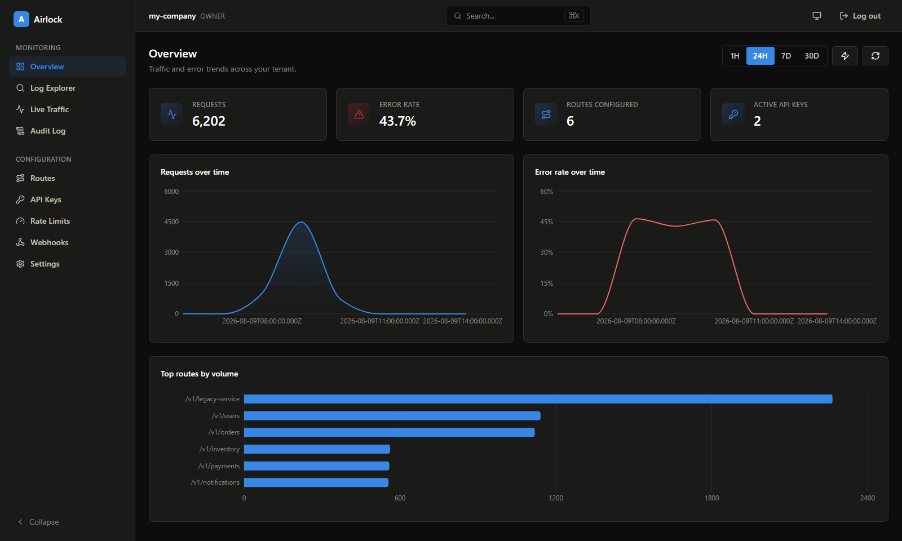
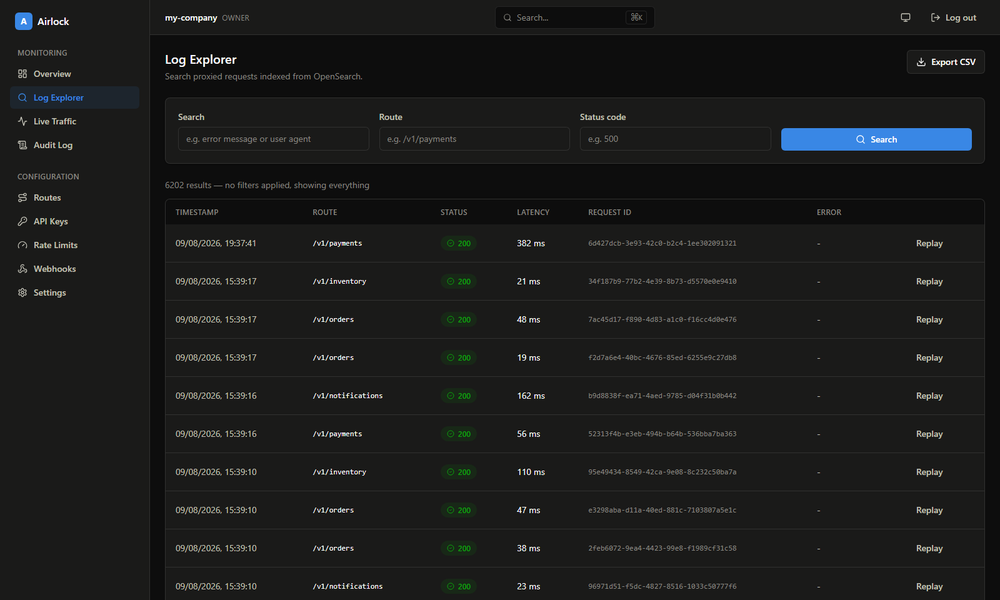
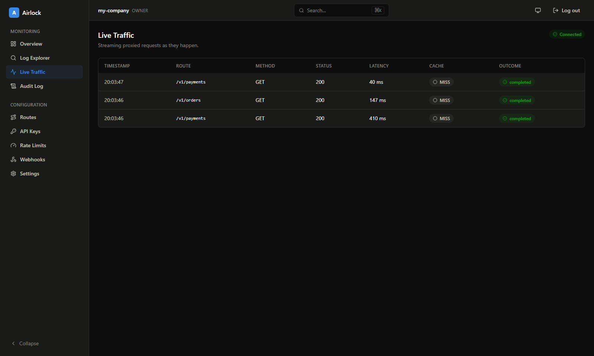
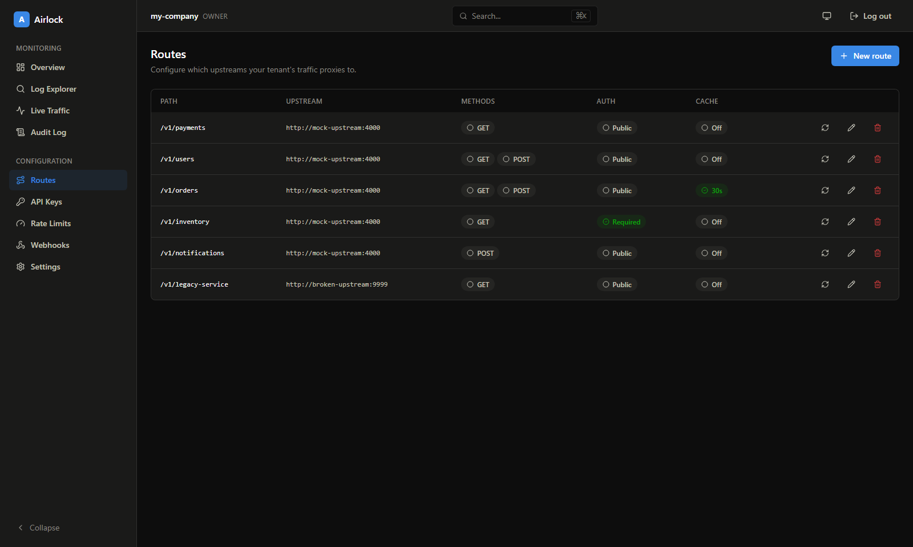
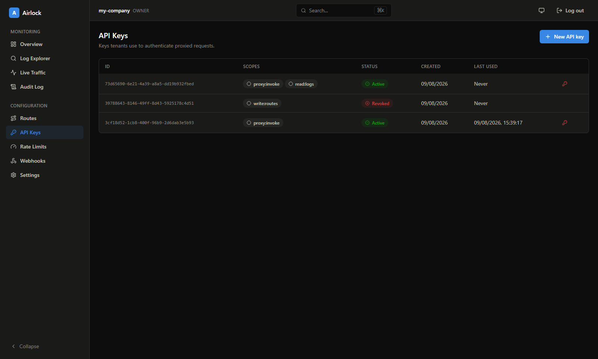
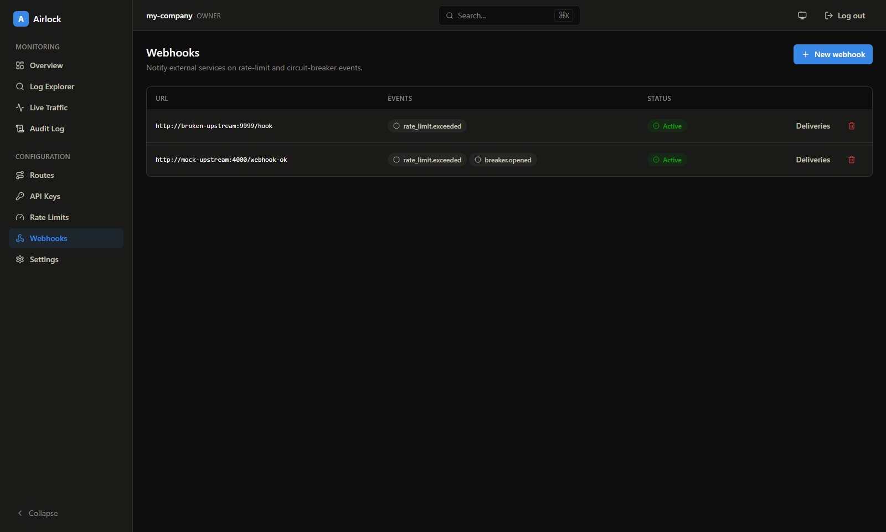

# Airlock

[](https://github.com/Yashmeet-Swami/airlock/actions/workflows/ci.yml)
[](LICENSE)

A self-hosted, multi-tenant API Gateway & Developer Platform: reverse proxy
routing, JWT + API-key auth, Redis-backed rate limiting/caching, async
webhooks (BullMQ), OpenSearch-powered log search/analytics, a per-upstream
circuit breaker, Prometheus/Grafana observability, MinIO-backed request
archival/replay + exports, and a full admin dashboard — built in seven
incremental, independently tested/committed phases (see Status below).

## Status

**Phase 1 — Foundation** (blueprint §24.2) is implemented: reverse proxy routing,
tenant/user model, JWT admin auth with refresh rotation, API-key issuance, route
CRUD, and OpenAPI/Swagger docs.

**Phase 2 — Redis: Caching & Rate Limiting** (blueprint §24.3) is implemented:
atomic token-bucket rate limiting (Redis Lua script, per-route/tenant-wide/fallback
policy resolution, `X-RateLimit-*`/`Retry-After` headers), cache-aside response
caching (`X-Cache: HIT|MISS`, explicit `/admin/cache/invalidate` + automatic
invalidation on route update), and a Redis-backed API-key validation cache with
immediate revocation busting.

**Phase 3 — Async: BullMQ, Workers, Webhooks** (blueprint §24.4) is implemented:
a separate `apps/workers` service consuming a BullMQ `webhooks` queue, tenant
webhook subscriptions (`/admin/webhooks`), HMAC-SHA256-signed delivery
(`X-Airlock-Signature: t=<unix>,v1=<hmac>` — see below), self-managed
retry/backoff matching §10.3's schedule (1s/5s/30s/2m/10m + jitter), a dead
letter state per delivery, and manual replay (`/admin/webhooks/deliveries/:id/replay`).
Only `rate_limit.exceeded` is wired as a dispatchable event so far — see the
Phase 3 plan for why the rest of the event catalog waits for the phases that
actually consume it.

**Phase 4 — Search: OpenSearch, Log Explorer, Analytics** (blueprint §24.5) is
implemented: every proxied request (`request.completed`/`.failed`) and every
`rate_limit.exceeded` event is indexed into a daily OpenSearch index
(`airlock-requests-{yyyy.MM.dd}`, §11.1's mapping exactly), via a second
`apps/workers` consumer (`logIndexer.worker.ts`) reading a new `requests`
BullMQ queue. `GET /logs/search` (full-text + filtered, tenant-scoped) and
`GET /logs/aggregate` (top routes / error-rate-over-time, also tenant-scoped)
sit on top of it, callable with either a dashboard JWT (any role) or an API
key carrying `read:logs`. A first, deliberately minimal `apps/dashboard`
(Vite + React, unstyled — see the backend-first policy below) adds a login
page and a Log Explorer table over `/logs/search`.

**Phase 5 — Resilience & Metrics** (blueprint §24.6) is implemented: a
per-upstream-origin circuit breaker (Redis Lua state machine — closed → open
past a configurable failure rate → half-open probe → closed/open again),
retries in the forwarder (idempotent methods or an `Idempotency-Key` header,
exponential backoff + jitter), Prometheus metrics (`GET /metrics` on the
gateway; a new minimal HTTP server on `apps/workers` exposing its own
`/metrics` + `/health`), `/health` split into `/health/liveness` and
`/health/readiness` (the latter checking Postgres + Redis), and an
`audit_log` table + `GET /admin/audit-log` recording every mutating admin
endpoint. Prometheus + Grafana ship in docker-compose, provisioned with one
dashboard (Traffic Overview: requests/sec, error rate, latency percentiles,
cache hit rate).

**Phase 6 — Advanced: Replay, Exports, Realtime, Hardening** (blueprint
§24.7) is implemented: every `request.completed`/`.failed` event now archives
its request/response (headers + size-capped bodies, auth headers redacted)
to MinIO as part of the same log-indexing job
(`request-archives/{tenant}/{yyyy}/{MM}/{dd}/{requestId}.json.gz`);
`POST /admin/replay/:requestId` looks the request up in OpenSearch, fetches
its archive, and re-issues it through the same `forwardRequest` used for live
traffic; `POST /analytics/export` runs the same filters as `/logs/search`,
formats matching hits as CSV/NDJSON, and returns a presigned MinIO URL;
`GET /realtime/traffic` streams live proxied-request events over SSE
(auth via `?token=`, since `EventSource` can't set headers) and the dashboard
gained a Live Traffic page; and routes are checked against a
private/link-local/loopback IP blocklist, opt-out per tenant via
`tenants.allow_internal_upstreams` (owner-only, `PATCH /admin/tenants/:id`;
defaults to allowed, since Airlock is self-hosted and pointing a route at a
co-located service — e.g. the `mock-upstream` fixture over the Docker Compose
network — is the normal case, not the exception; tenants wanting the
stricter SaaS-style posture can opt out).

**Phase 7 (added after Phase 6, not in the original 6-phase plan) — Dashboard
UI Overhaul.** Airlock was built backend-first on purpose: every phase above
shipped with only the bare-minimum UI needed to verify what it built, on the
understanding that a dedicated phase would turn it into a real product once
the backend reached feature completeness. That phase is done. `apps/dashboard`
is now a full admin experience — Overview (KPI tiles, time-range presets,
auto-refresh, requests/error-rate/top-routes charts), Routes, API Keys, Rate
Limits, Webhooks (+ deliveries + dead-letter replay), Audit Log, Settings,
plus the restyled Log Explorer and Live Traffic — built with Tailwind v4,
React Router, TanStack Query, and Recharts, with a Light/Dark/System theme and
a `Ctrl+K` command palette. See [Screenshots](#screenshots) below.

## Screenshots


| Overview | Log Explorer | Live Traffic |
|---|---|---|
|  |  |  |

| Routes | API Keys | Webhooks |
|---|---|---|
|  |  |  |

### Verifying a webhook signature

Every delivery includes an `X-Airlock-Signature: t=<unix seconds>,v1=<hex hmac>`
header (Stripe-style) and an `X-Airlock-Event` header. To verify:

```
expected = HMAC-SHA256(secret, `${t}.${rawRequestBody}`)
compare `expected` to `v1` using a constant-time comparison
```

Reject the request if the signature doesn't match, or if `t` is too far from
the current time (replay defense, §21.1).

## Quickstart

```bash
npm install
npm run dev
```

This brings up Postgres, Redis, OpenSearch, MinIO, Prometheus, Grafana, the
gateway, the workers service (webhook delivery + log indexing), the
dashboard, and a small `mock-upstream` fixture service via Docker Compose,
running migrations automatically. Once healthy:

- Gateway: http://localhost:3000
- Swagger UI: http://localhost:3000/docs
- Dashboard: http://localhost:5173
- OpenSearch: http://localhost:9200
- Mock upstream: http://localhost:4000
- Prometheus: http://localhost:9090
- Grafana: http://localhost:3300 (admin/admin, or browse anonymously as a viewer)
- MinIO console: http://localhost:9001 (airlock-minio/airlock-minio-secret)

Stop everything with `npm run dev:down`.

### Try it end-to-end

```bash
# 1. Register a tenant + owner user
curl -s -X POST http://localhost:3000/auth/register \
  -H "Content-Type: application/json" \
  -d '{"tenantName":"acme-corp","email":"owner@acme.test","password":"hunter22222"}'
# => { accessToken, refreshToken, user }

# 2. Create a route pointing at the mock upstream
curl -s -X POST http://localhost:3000/admin/routes \
  -H "Authorization: Bearer <accessToken>" -H "Content-Type: application/json" \
  -d '{"pathPattern":"/v1/payments","upstreamUrl":"http://mock-upstream:4000","methods":["GET"]}'

# 3. Issue an API key
curl -s -X POST http://localhost:3000/admin/api-keys \
  -H "Authorization: Bearer <accessToken>" -H "Content-Type: application/json" \
  -d '{"scopes":["proxy:invoke"]}'
# => { rawKey: "gk_live_..." }

# 4. Call the proxied route
curl -s http://localhost:3000/proxy/acme-corp/v1/payments -H "X-API-Key: <rawKey>"

# 5. (Phase 2) Set a tight rate limit and watch it kick in
curl -s -X POST http://localhost:3000/admin/rate-limit-policies \
  -H "Authorization: Bearer <accessToken>" -H "Content-Type: application/json" \
  -d '{"routeId":"<routeId>","limitCount":3,"windowSeconds":10}'
# hammer /proxy/acme-corp/v1/payments a few times — the 4th within the window gets 429 + Retry-After

# 6. (Phase 2) Mark a route cacheable and see X-Cache flip from MISS to HIT
curl -s -i http://localhost:3000/proxy/acme-corp/v1/payments | grep -i x-cache

# 7. (Phase 4) Search the request you just made (indexing is async — give it a second)
curl -s "http://localhost:3000/logs/search?route=/v1/payments" -H "Authorization: Bearer <accessToken>"

# 8. (Phase 4) See it show up in the per-route aggregate too
curl -s "http://localhost:3000/logs/aggregate" -H "Authorization: Bearer <accessToken>"

# 9. (Phase 5) Watch the circuit breaker trip against a route pointed at
#    something that always fails, then curl /metrics and see it flip:
curl -s http://localhost:3000/metrics | grep airlock_circuit_breaker_state

# 10. (Phase 5) See your own mutations show up in the audit log
curl -s http://localhost:3000/admin/audit-log -H "Authorization: Bearer <accessToken>"

# 11. (Phase 6) Replay an archived request (indexing + archival are async — give it a second)
curl -s -X POST "http://localhost:3000/admin/replay/<requestId>" -H "Authorization: Bearer <accessToken>"

# 12. (Phase 6) Export matching logs and download via the presigned URL
curl -s -X POST http://localhost:3000/analytics/export \
  -H "Authorization: Bearer <accessToken>" -H "Content-Type: application/json" \
  -d '{"format":"csv"}'

# 13. (Phase 6) Watch live traffic over SSE (the dashboard's Live Traffic page does this too)
curl -N "http://localhost:3000/realtime/traffic?token=<accessToken>"
```

## Development

- `npm run build` — type-check every workspace (`tsc --noEmit`)
- `npm run lint` — ESLint across the monorepo
- `npm test` — runs each workspace's own suite; `gateway` and `workers` each spin
  up their own throwaway Postgres + Redis + OpenSearch containers via Docker
  (requires Docker to be running; OpenSearch is JVM-based and noticeably
  slower to boot than Postgres/Redis) — `workers`' harness runs gateway's
  migrations against its own container since gateway owns the schema
- `npm run migrate` — apply pending Postgres migrations to whatever
  `DATABASE_URL` currently points at
- `npm run test:load --workspace=@airlock/gateway` — best-effort k6 load test
  (blueprint §24.7) against the live docker-compose stack; not part of `npm
  test` or any CI gate — see `apps/gateway/test/load/rateLimit.k6.js`

## Design decisions

The trade-offs that actually shaped this codebase, distilled:

- **Atomic Redis Lua, not `INCR`+`EXPIRE`.** Both the rate limiter and the
  circuit breaker need a check-then-update to be a single atomic operation
  under concurrent requests — a naive two-command approach has a race window
  where two requests can both read "under the limit" before either writes.
  Both features use `redis.defineCommand()`-registered Lua scripts for
  exactly this reason.
- **"Reset every N," not a true sliding-window log.** A real sliding window
  needs a sorted set of every request's timestamp — unbounded memory growth
  under load. Both the rate limiter and circuit breaker instead count
  successes/failures in a hash and reset at N, a standard, documented
  simplification traded once and reused twice.
- **Archival lives inside the log-indexing job, not a second BullMQ worker.**
  BullMQ workers on one queue are *competing* consumers, not pub/sub — a
  second `Worker` on the same queue would only see some events, not all of
  them. Archival is a second step of the same job instead, at the cost of a
  coupled failure domain (a retry re-indexes too).
- **SSRF defense defaults to opt-out, not opt-in — a real bug caught by
  actually running the stack.** It first defaulted to blocking private/
  link-local upstreams unless a tenant explicitly opted in, which broke the
  project's own quickstart demo: Docker Compose service names resolve to
  private container IPs, and Airlock is self-hosted, where pointing a route
  at a co-located service is the normal case. Flipped to opt-out once that
  became obvious from live-testing, not from reasoning about it in the abstract.
- **Tenant isolation is enforced once, at the data-access layer.** Every
  query goes through a single `withTenantScope(tenantId)` helper deriving
  `tenant_id` from the authenticated principal — never a client-supplied
  parameter — specifically so isolation can't be forgotten in a one-off
  endpoint. A dedicated security suite asserts tenant A can never read tenant
  B's routes, keys, logs, or webhooks even with a guessed ID.
- **Refresh tokens rotate and detect reuse.** Every refresh burns the old
  token and issues a new one; presenting an already-rotated token is treated
  as a stolen-token signal and revokes every session for that user, not just
  the one being used.
- **The dashboard's dark mode was nearly free — because of a decision made
  before it existed.** Every component draws from CSS custom properties
  (`bg-page`, `text-ink`, `border-border`, ...) instead of hardcoded colors.
  Dark mode ended up being mostly redefining those *values* under one `.dark`
  class, not a per-component rewrite.
- **A Vite dev-proxy prefix bug, found twice in a row.** Proxying bare paths
  like `/logs` straight to the backend meant a full-page refresh on the
  dashboard's own `/logs` route hit the proxy instead of the SPA and 404'd.
  Fixed by routing everything through one `/api/` prefix — then hit the exact
  same bug one level deeper, because a bare `/api` key also prefix-matches
  `/api-keys`. The trailing slash is load-bearing.
- **SSE needs an explicit header flush.** `res.writeHead()` alone doesn't
  push headers onto the socket in Node — they stay buffered until the first
  `res.write()`. Without `res.flushHeaders()`, the live-traffic client saw
  nothing until the first real event or the next heartbeat, which
  `EventSource` reports as a dropped connection, not a slow one.

## Layout

See blueprint §23 for the full rationale. Summary: `apps/*` are independently
deployable services (`gateway`, `workers` — BullMQ webhook delivery + log
indexing, `dashboard` — a full admin UI (Tailwind v4 + React Router +
TanStack Query + Recharts), `mock-upstream` — a dev/test fixture, not a
shipped product), `packages/*` is code shared between apps (`shared-types`),
and `infra/` holds Docker/monitoring config.
