# Airlock — Project Blueprint

**A self-hosted, multi-tenant API Gateway & Developer Platform**
*Software Design Document · Architecture Guide · Development Roadmap · Engineering Handbook*

| | |
|---|---|
| **Document status** | Living — single source of truth |
| **Document owner** | Yashmeet Swami |
| **Version** | 1.0.0 |
| **License model** | 100% free / open-source stack |
| **Target audience** | Any engineer picking up this project cold |

> This document is written the way an internal design doc at a platform-engineering team would be written. It assumes the reader has general backend experience but zero prior context on this specific system. Every architectural decision is justified; every diagram is meant to be read, not decorated.

---

## Table of Contents

1. [Executive Summary](#1-executive-summary)
2. [Inspiration & Competitive Landscape](#2-inspiration--competitive-landscape)
3. [Functional Requirements](#3-functional-requirements)
4. [Non-Functional Requirements](#4-non-functional-requirements)
5. [Complete System Architecture](#5-complete-system-architecture)
6. [Request Lifecycle](#6-request-lifecycle)
7. [Technology Decisions](#7-technology-decisions)
8. [Database Design](#8-database-design)
9. [Redis Design](#9-redis-design)
10. [Queue Design](#10-queue-design)
11. [Search Architecture](#11-search-architecture)
12. [Object Storage](#12-object-storage)
13. [Authentication](#13-authentication)
14. [Authorization](#14-authorization)
15. [Rate Limiting](#15-rate-limiting)
16. [Circuit Breaker](#16-circuit-breaker)
17. [Caching](#17-caching)
18. [Event-Driven Architecture](#18-event-driven-architecture)
19. [Logging](#19-logging)
20. [Monitoring](#20-monitoring)
21. [Security](#21-security)
22. [API Design](#22-api-design)
23. [Folder Structure](#23-folder-structure)
24. [Development Phases](#24-development-phases)
25. [Git Commit Plan](#25-git-commit-plan)
26. [Learning Roadmap](#26-learning-roadmap)
27. [Resume Impact](#27-resume-impact)
28. [Interview Questions](#28-interview-questions)
29. [Future Scope](#29-future-scope)
30. [Final Architecture](#30-final-architecture)

---

## 1. Executive Summary

### 1.1 What Airlock is

Airlock is a self-hosted **API Gateway and Developer Platform**. It sits between external/internal API consumers and one or more backend ("upstream") services, and provides — as a single shared layer — everything those upstream services would otherwise have to reimplement individually:

- Tenant-aware authentication (API keys + JWT)
- Per-tenant, per-route rate limiting
- Response caching
- Circuit breaking against unhealthy upstreams
- Structured, correlated logging
- Full request/response observability (metrics, searchable logs, dashboards)
- Event-driven webhook delivery to tenants
- An admin API and dashboard to configure all of the above

In short: it is a small, self-hosted, open-source clone of the *category* of product that Kong, Cloudflare API Gateway, Apigee, and AWS API Gateway occupy — scoped to what one engineer can build and defend in an interview.

### 1.2 Why companies build this

No company wants every microservice team reimplementing auth, rate limiting, and observability independently. The moment an organization has more than a handful of services, or exposes APIs to external partners, a **shared edge layer** becomes mandatory — otherwise:

- Every team ships a slightly different (and usually worse) rate limiter.
- There is no single place to see "who is calling us, how often, and how expensive is it."
- A partner integration having a bug can silently take down a shared downstream dependency (no circuit breaking).
- Revoking a compromised credential means finding and patching N services instead of one.

Airlock exists to be that shared layer.

### 1.3 Real-world use cases

| Use case | Example |
|---|---|
| Partner/B2B API exposure | A fintech exposes a `/payments` API to 40 partner companies, each with different rate limits and SLAs |
| Internal service mesh edge | Multiple internal microservices proxied through one gateway for consistent auth + observability |
| Public API monetization | A SaaS company metering API usage per plan tier (free/pro/enterprise) |
| Compliance/audit | Every request must be logged, searchable, and archived for 90 days for audit purposes |
| Abuse prevention | Preventing a single misbehaving API consumer from degrading service for everyone else |

### 1.4 Problems it solves

1. **Duplicated cross-cutting logic** — auth, rate limiting, logging implemented once, not N times.
2. **Blast-radius containment** — a failing upstream doesn't cascade (circuit breaker).
3. **Visibility** — nobody can answer "what's happening on our API right now" without this layer.
4. **Fair usage** — noisy-neighbor tenants cannot starve others of capacity.
5. **Auditability & replay** — every request is archived and searchable for debugging and compliance.

### 1.5 Why this project is valuable for SDE-1 interviews

Unlike CRUD applications, Airlock forces engagement with the exact system-design vocabulary used in real interviews: distributed rate limiting correctness, cache invalidation, circuit breakers, idempotent delivery, multi-tenancy, and horizontal scalability under shared state. It converts abstract "design a rate limiter" whiteboard questions into a system you actually built, measured, and can defend with real numbers (throughput, latency percentiles, correctness under concurrency) — which is a categorically stronger answer than "I read about it."

---

## 2. Inspiration & Competitive Landscape

Airlock does not attempt to replace any of the following — it borrows their core ideas at a scope buildable by one engineer in 6-8 weeks.

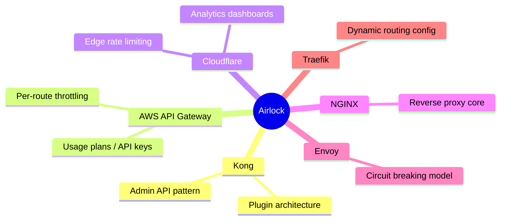
```mermaid
mindmap
  root((Airlock))
    Kong
      Plugin architecture
      Admin API pattern
    AWS API Gateway
      Usage plans / API keys
      Per-route throttling
    Cloudflare
      Edge rate limiting
      Analytics dashboards
    NGINX
      Reverse proxy core
    Envoy
      Circuit breaking model
    Traefik
      Dynamic routing config
```

### 2.1 Comparison table

| Capability | Kong | AWS API Gateway | Cloudflare | NGINX | Envoy | Traefik | **Airlock** |
|---|---|---|---|---|---|---|---|
| Open source | ✅ (core) | ❌ (managed) | ❌ (managed) | ✅ | ✅ | ✅ | ✅ |
| Self-hostable for free | ✅ | ❌ | ❌ | ✅ | ✅ | ✅ | ✅ |
| Multi-tenant rate limiting | ✅ (plugin) | ✅ | ✅ | ⚠️ (manual config) | ⚠️ (manual config) | ⚠️ (manual config) | ✅ (built-in, first-class) |
| API-key & tenant management UI | ✅ (Enterprise) | ✅ | ✅ | ❌ | ❌ | ⚠️ (basic) | ✅ |
| Circuit breaking | ⚠️ (plugin) | ❌ | ❌ | ❌ | ✅ | ⚠️ (basic) | ✅ |
| Searchable request logs | ❌ (needs ELK) | ✅ (CloudWatch, paid) | ✅ (paid) | ❌ | ❌ | ❌ | ✅ (OpenSearch, free) |
| Webhook/event delivery | ⚠️ (plugin) | ⚠️ (EventBridge, paid) | ❌ | ❌ | ❌ | ❌ | ✅ |
| Learning-oriented / hackable | ⚠️ (Lua plugins, steep) | ❌ | ❌ | ⚠️ | ⚠️ (C++, steep) | ✅ | ✅ (own codebase, full control) |
| Cost to run | Free (self-host) | $$$ pay-per-call | $$$ enterprise tiers | Free | Free | Free | **$0** |

**Positioning statement:** Airlock is not competing on production maturity — Kong and Envoy have years of hardening. Airlock's value is that *every line is understood and owned by the builder*, which is precisely what an interview panel wants to probe.

---

## 3. Functional Requirements

| ID | Feature | Description | Phase |
|---|---|---|---|
| FR-1 | Reverse proxy routing | Route incoming requests to configured upstream services by path/tenant | 1 |
| FR-2 | API key issuance & validation | Tenants can generate/revoke scoped, hashed API keys | 1 |
| FR-3 | JWT admin authentication | Dashboard/admin API secured via access + refresh JWT | 1 |
| FR-4 | Tenant management | CRUD for tenants (the organizations using the gateway) | 1 |
| FR-5 | Route configuration | CRUD for upstream route mappings, methods, auth requirements | 1 |
| FR-6 | Swagger/OpenAPI docs | Full OpenAPI spec for the admin + analytics APIs | 1 |
| FR-7 | Response caching | Cache-aside caching of idempotent GET responses per route | 2 |
| FR-8 | Rate limiting | Per-tenant and per-route configurable limits (token bucket) | 2 |
| FR-9 | Rate-limit policy management | Admin API to configure limits per tenant/route | 2 |
| FR-10 | Webhook subscriptions | Tenants register webhook URLs for gateway events | 3 |
| FR-11 | Webhook delivery workers | Reliable, retried, idempotent webhook dispatch | 3 |
| FR-12 | Background job processing | BullMQ-based async processing for logs, webhooks, archival | 3 |
| FR-13 | Request/response log indexing | Every proxied request indexed into OpenSearch | 4 |
| FR-14 | Log search / explorer | Full-text + filtered search over historical requests | 4 |
| FR-15 | Analytics API & dashboard | Aggregate traffic, error rate, top tenants, latency percentiles | 4 |
| FR-16 | Prometheus metrics | `/metrics` endpoint exposing gateway health/performance | 5 |
| FR-17 | Grafana dashboards | Pre-built dashboards for latency, throughput, errors, queue depth | 5 |
| FR-18 | Circuit breaker | Per-upstream automatic failure isolation | 5 |
| FR-19 | Audit logging | Immutable log of all admin actions (who changed what, when) | 5 |
| FR-20 | Request replay | Re-send an archived request against an upstream for debugging | 6 |
| FR-21 | Log/analytics export | Export logs or usage reports as CSV/NDJSON from MinIO | 6 |
| FR-22 | Real-time traffic dashboard | Live requests/sec, error rate, rate-limit rejections via SSE | 6 |
| FR-23 | Multi-tenancy isolation | Strict tenant data isolation across every layer | All |
| FR-24 | Role-based access control | Owner/Admin/Viewer roles scoped per tenant | 1 |

---

## 4. Non-Functional Requirements

| Category | Requirement | Target / Metric |
|---|---|---|
| **Performance** | Gateway proxy overhead must stay low | < 15ms p95 added latency vs. direct upstream call |
| **Availability** | Gateway must degrade gracefully, not fail hard | Configurable fail-open/fail-closed if Redis/Postgres unreachable |
| **Reliability** | Webhook delivery must not silently drop events | At-least-once delivery, DLQ after exhausted retries |
| **Scalability** | Gateway instances must scale horizontally with no shared local state | Stateless process; all shared state in Redis/Postgres |
| **Fault tolerance** | A single failing upstream must not affect other upstreams | Per-upstream circuit breaker isolation |
| **Security** | No tenant may access another tenant's data | Enforced at DB query layer + integration-tested |
| **Latency** | Rate-limit check must be near-instant | < 2ms Redis round-trip for a rate-limit decision (Lua script) |
| **Maintainability** | Codebase must be navigable by a new engineer | Modular services, documented boundaries (this doc) |
| **Observability** | Every request traceable end-to-end | Correlation ID propagated from ingress to webhook delivery |
| **Correctness under concurrency** | Rate limits must hold even with N gateway replicas hitting Redis concurrently | Verified via k6 load test with concurrent overlapping requests |

---

## 5. Complete System Architecture

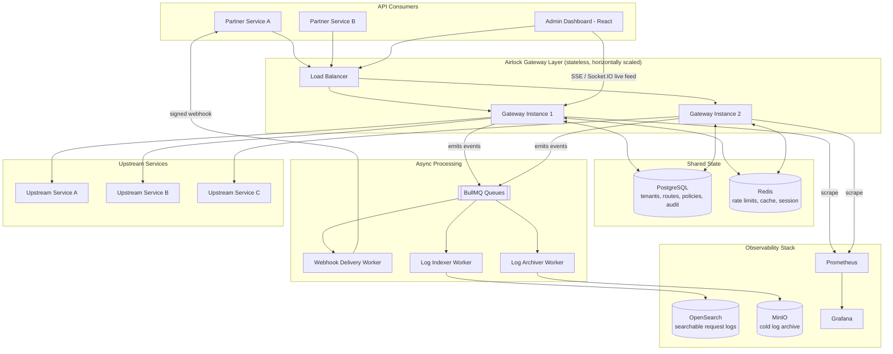
```mermaid
flowchart TB
    subgraph Clients["API Consumers"]
        C1[Partner Service A]
        C2[Partner Service B]
        C3[Admin Dashboard - React]
    end

    subgraph Edge["Airlock Gateway Layer (stateless, horizontally scaled)"]
        GW1[Gateway Instance 1]
        GW2[Gateway Instance 2]
        LB[Load Balancer]
    end

    subgraph Data["Shared State"]
        PG[(PostgreSQL<br/>tenants, routes, policies, audit)]
        RD[(Redis<br/>rate limits, cache, session)]
    end

    subgraph Async["Async Processing"]
        BQ[[BullMQ Queues]]
        WK1[Webhook Delivery Worker]
        WK2[Log Indexer Worker]
        WK3[Log Archiver Worker]
    end

    subgraph Observability["Observability Stack"]
        OS[(OpenSearch<br/>searchable request logs)]
        MI[(MinIO<br/>cold log archive)]
        PR[Prometheus]
        GF[Grafana]
    end

    subgraph Upstreams["Upstream Services"]
        U1[Upstream Service A]
        U2[Upstream Service B]
        U3[Upstream Service C]
    end

    C1 --> LB
    C2 --> LB
    C3 --> LB
    LB --> GW1
    LB --> GW2

    GW1 <--> RD
    GW2 <--> RD
    GW1 <--> PG
    GW2 <--> PG

    GW1 --> U1
    GW1 --> U2
    GW2 --> U3

    GW1 -- emits events --> BQ
    GW2 -- emits events --> BQ
    BQ --> WK1
    BQ --> WK2
    BQ --> WK3

    WK1 -- signed webhook --> C1
    WK2 --> OS
    WK3 --> MI

    GW1 -- scrape --> PR
    GW2 -- scrape --> PR
    PR --> GF

    C3 -- SSE / Socket.IO live feed --> GW1
```

### 5.1 Component responsibilities

| Component | Responsibility |
|---|---|
| **Gateway (Node/Express)** | Stateless reverse proxy: auth, rate limiting, caching, circuit breaking, event emission |
| **PostgreSQL** | System-of-record for tenants, API keys, routes, rate-limit policies, webhooks, audit log |
| **Redis** | Ephemeral shared state: rate-limit counters, response cache, hot-config cache |
| **BullMQ (on Redis)** | Durable async job queue for webhook delivery, log indexing, archival |
| **OpenSearch** | Searchable index of request/response metadata (hot, TTL'd window) |
| **MinIO** | Cold storage for archived request/response bodies + analytics exports |
| **Prometheus** | Metrics scraping from gateway + worker processes |
| **Grafana** | Dashboards over Prometheus metrics |
| **React Dashboard** | Admin UI + live traffic view + log explorer |

---

## 6. Request Lifecycle

### 6.1 Sequence diagram — happy path

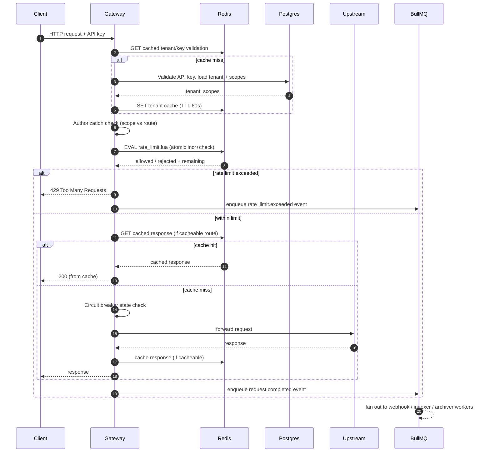
```mermaid
sequenceDiagram
    autonumber
    participant Client
    participant Gateway
    participant Redis
    participant Postgres
    participant Upstream
    participant Queue as BullMQ

    Client->>Gateway: HTTP request + API key
    Gateway->>Redis: GET cached tenant/key validation
    alt cache miss
        Gateway->>Postgres: Validate API key, load tenant + scopes
        Postgres-->>Gateway: tenant, scopes
        Gateway->>Redis: SET tenant cache (TTL 60s)
    end
    Gateway->>Gateway: Authorization check (scope vs route)
    Gateway->>Redis: EVAL rate_limit.lua (atomic incr+check)
    Redis-->>Gateway: allowed / rejected + remaining
    alt rate limit exceeded
        Gateway-->>Client: 429 Too Many Requests
        Gateway->>Queue: enqueue rate_limit.exceeded event
    else within limit
        Gateway->>Redis: GET cached response (if cacheable route)
        alt cache hit
            Redis-->>Gateway: cached response
            Gateway-->>Client: 200 (from cache)
        else cache miss
            Gateway->>Gateway: Circuit breaker state check
            Gateway->>Upstream: forward request
            Upstream-->>Gateway: response
            Gateway->>Redis: cache response (if cacheable)
            Gateway-->>Client: response
        end
        Gateway->>Queue: enqueue request.completed event
    end
    Queue-->>Queue: fan out to webhook / indexer / archiver workers
```

### 6.2 Step-by-step breakdown

1. **Client → Gateway**: request arrives with `X-API-Key` or `Authorization: Bearer <jwt>`.
2. **Authentication**: API key hash looked up (Redis-cached, Postgres-backed) or JWT verified.
3. **Authorization**: requested route checked against the key's scopes / tenant's role.
4. **Rate limiting**: atomic Redis Lua script evaluates token bucket for `tenant:route`.
5. **Cache check**: if route is marked cacheable and method is GET, check Redis cache.
6. **Circuit breaker check**: if the target upstream's breaker is OPEN, short-circuit with `503`.
7. **Proxy to upstream**: forward method/headers/body, apply timeout.
8. **Response handling**: cache if applicable, record latency/status for circuit breaker.
9. **Event emission**: publish `request.completed` (or `.failed`, `.rate_limited`) to BullMQ.
10. **Async fan-out**: webhook dispatch, OpenSearch indexing, real-time dashboard push — all off the request's critical path.

### 6.3 Decision tree — should this request be served from cache?

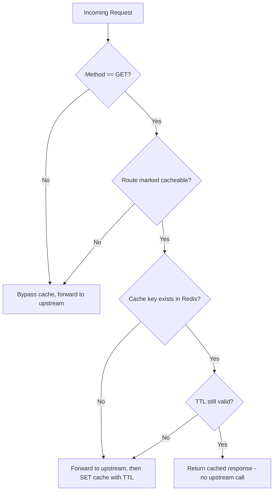
```mermaid
flowchart TD
    A[Incoming Request] --> B{Method == GET?}
    B -- No --> Z[Bypass cache, forward to upstream]
    B -- Yes --> C{Route marked cacheable?}
    C -- No --> Z
    C -- Yes --> D{Cache key exists in Redis?}
    D -- No --> E[Forward to upstream, then SET cache with TTL]
    D -- Yes --> F{TTL still valid?}
    F -- No --> E
    F -- Yes --> G[Return cached response - no upstream call]
```

---

## 7. Technology Decisions

| Technology | Chosen for | Why | Alternative considered | Why rejected |
|---|---|---|---|---|
| **Node.js + Express** | Gateway runtime | Non-blocking I/O suits proxying; fastest to ship; matches JS/TS skill depth | Go (Fiber/Chi) | Better raw perf, but slower to build in given timeframe; TS ecosystem better for this portfolio |
| **Redis** | Rate limiting, caching, session/config cache | Atomic ops (Lua/EVAL) give race-safe counters; sub-ms latency; also backs BullMQ | Memcached | No atomic scripting, no pub/sub, no native queue support |
| **BullMQ** | Background job processing | Battle-tested Redis-backed queue with retries, backoff, priorities, and DLQ support built in | RabbitMQ | Would require running an extra broker for no added learning value at this scope |
| **PostgreSQL** | System of record | Strong relational integrity needed for tenants/keys/policies/audit; ACID matters for billing-adjacent data | MongoDB | Data is inherently relational (tenants→keys→routes→policies); joins matter more than schema flexibility |
| **OpenSearch** | Searchable log index | Free/open-source fork of Elasticsearch with identical query DSL; ideal for full-text + filtered log search | Plain Postgres full-text search | Doesn't scale to high-volume log search or give faceted/aggregation queries as naturally |
| **MinIO** | Object storage | S3-compatible API, runs free in Docker, teaches real object-storage patterns (buckets, lifecycle) | Local filesystem | Doesn't teach transferable S3-API skills; no lifecycle policies |
| **Docker Compose** | Local orchestration | One command spins up the entire 8-service system reproducibly | Kubernetes (minikube) | Massive added complexity for a single-engineer, 6-8 week project; can be a documented "future scope" instead |
| **Pino** | Structured logging | Fastest JSON logger for Node; trivial correlation-ID injection via child loggers | Winston | Slower, more config overhead for equivalent output |
| **Prometheus** | Metrics collection | De facto standard, pull-based, integrates trivially with `prom-client` | StatsD | Push-based model is more operationally complex for a local single-host setup |
| **Grafana** | Dashboards | Free, pairs natively with Prometheus, industry-standard | Kibana | Better paired with OpenSearch for *logs*, but Grafana already covers metrics **and** can visualize OpenSearch too — one tool, less duplication |
| **Socket.IO / SSE** | Real-time dashboard feed | Free, no external broker required beyond existing Redis; SSE for one-directional feed is simpler than full WS where bidirectional isn't needed | Kafka + WebSocket gateway | Massive overkill for a single live dashboard feed |

---

## 8. Database Design

### 8.1 Entity-Relationship Diagram

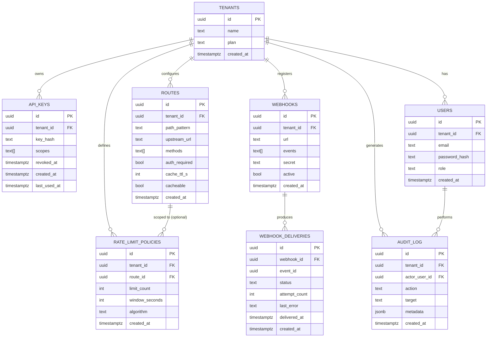
```mermaid
erDiagram
    TENANTS ||--o{ API_KEYS : owns
    TENANTS ||--o{ ROUTES : configures
    TENANTS ||--o{ RATE_LIMIT_POLICIES : defines
    TENANTS ||--o{ WEBHOOKS : registers
    TENANTS ||--o{ USERS : has
    TENANTS ||--o{ AUDIT_LOG : generates
    ROUTES ||--o{ RATE_LIMIT_POLICIES : "scoped to (optional)"
    WEBHOOKS ||--o{ WEBHOOK_DELIVERIES : produces
    USERS ||--o{ AUDIT_LOG : performs

    TENANTS {
        uuid id PK
        text name
        text plan
        timestamptz created_at
    }
    USERS {
        uuid id PK
        uuid tenant_id FK
        text email
        text password_hash
        text role
        timestamptz created_at
    }
    API_KEYS {
        uuid id PK
        uuid tenant_id FK
        text key_hash
        text[] scopes
        timestamptz revoked_at
        timestamptz created_at
        timestamptz last_used_at
    }
    ROUTES {
        uuid id PK
        uuid tenant_id FK
        text path_pattern
        text upstream_url
        text[] methods
        bool auth_required
        int cache_ttl_s
        bool cacheable
        timestamptz created_at
    }
    RATE_LIMIT_POLICIES {
        uuid id PK
        uuid tenant_id FK
        uuid route_id FK
        int limit_count
        int window_seconds
        text algorithm
        timestamptz created_at
    }
    WEBHOOKS {
        uuid id PK
        uuid tenant_id FK
        text url
        text[] events
        text secret
        bool active
        timestamptz created_at
    }
    WEBHOOK_DELIVERIES {
        uuid id PK
        uuid webhook_id FK
        uuid event_id
        text status
        int attempt_count
        text last_error
        timestamptz delivered_at
        timestamptz created_at
    }
    AUDIT_LOG {
        uuid id PK
        uuid tenant_id FK
        uuid actor_user_id FK
        text action
        text target
        jsonb metadata
        timestamptz created_at
    }
```

### 8.2 Table reference

**tenants** — the top-level isolation boundary; every other table hangs off this.

| Column | Type | Constraint | Notes |
|---|---|---|---|
| id | uuid | PK, default gen_random_uuid() | |
| name | text | NOT NULL, UNIQUE | Display name |
| plan | text | NOT NULL, default 'free' | Drives default rate-limit tier |
| created_at | timestamptz | NOT NULL, default now() | |

**users** — human accounts that log into the admin dashboard.

| Column | Type | Constraint | Notes |
|---|---|---|---|
| id | uuid | PK | |
| tenant_id | uuid | FK → tenants.id, NOT NULL | |
| email | text | UNIQUE, NOT NULL | |
| password_hash | text | NOT NULL | bcrypt/argon2 |
| role | text | NOT NULL, CHECK IN ('owner','admin','viewer') | See [§14](#14-authorization) |
| created_at | timestamptz | NOT NULL | |

**api_keys** — machine credentials used by tenants to call through the gateway.

| Column | Type | Constraint | Notes |
|---|---|---|---|
| id | uuid | PK | |
| tenant_id | uuid | FK → tenants.id, NOT NULL, indexed | |
| key_hash | text | NOT NULL, UNIQUE, indexed | SHA-256 of the actual key; raw key shown once at creation |
| scopes | text[] | NOT NULL, default '{}' | e.g. `{read:logs, write:routes}` |
| revoked_at | timestamptz | NULLABLE | NULL = active |
| created_at | timestamptz | NOT NULL | |
| last_used_at | timestamptz | NULLABLE | updated async, not on hot path |

**routes** — the mapping the proxy uses to route + configure a path.

| Column | Type | Constraint | Notes |
|---|---|---|---|
| id | uuid | PK | |
| tenant_id | uuid | FK, NOT NULL | |
| path_pattern | text | NOT NULL | e.g. `/v1/payments/*` |
| upstream_url | text | NOT NULL | validated against allowlist (SSRF defense, [§21](#21-security)) |
| methods | text[] | NOT NULL | `{GET,POST}` |
| auth_required | bool | NOT NULL, default true | |
| cacheable | bool | NOT NULL, default false | |
| cache_ttl_s | int | NOT NULL, default 0 | |
| created_at | timestamptz | NOT NULL | |

Index: `UNIQUE (tenant_id, path_pattern)`; `INDEX (tenant_id)`.

**rate_limit_policies** — configurable limits, optionally scoped to a specific route.

| Column | Type | Constraint | Notes |
|---|---|---|---|
| id | uuid | PK | |
| tenant_id | uuid | FK, NOT NULL | |
| route_id | uuid | FK, NULLABLE | NULL = applies tenant-wide |
| limit_count | int | NOT NULL | max requests |
| window_seconds | int | NOT NULL | window size |
| algorithm | text | NOT NULL, default 'token_bucket' | see [§15](#15-rate-limiting) |
| created_at | timestamptz | NOT NULL | |

**webhooks** / **webhook_deliveries** — event subscription + delivery audit trail. See [§10](#10-queue-design).

**audit_log** — append-only, never updated/deleted; mirrored into OpenSearch for search.

### 8.3 Indexing strategy

| Table | Index | Purpose |
|---|---|---|
| api_keys | `UNIQUE(key_hash)` | O(1) lookup on every authenticated request |
| routes | `UNIQUE(tenant_id, path_pattern)` | Prevent duplicate route config, fast routing lookup |
| rate_limit_policies | `INDEX(tenant_id, route_id)` | Fast policy resolution |
| webhook_deliveries | `INDEX(webhook_id, status)` | Fast DLQ / retry queries |
| audit_log | `INDEX(tenant_id, created_at DESC)` | Recent-activity queries |

Note: raw request/response bodies are **deliberately not stored in Postgres** — see [§11](#11-search-architecture) and [§12](#12-object-storage). Postgres holds configuration and audit data only; it must stay small and fast.

---

## 9. Redis Design

### 9.1 Key naming conventions

| Pattern | Example | TTL | Purpose |
|---|---|---|---|
| `apikey:{hash}` | `apikey:9f8a...` | 60s | Cached tenant/scope lookup, avoids Postgres hit per request |
| `ratelimit:{tenant}:{route}:{window}` | `ratelimit:acme:v1-payments:1717000` | window length | Token bucket counter |
| `cache:resp:{tenant}:{route}:{hash(query)}` | `cache:resp:acme:v1-users:a1b2` | route-configured (e.g. 30s) | Cached GET response body + headers |
| `route:{tenant}:{path}` | `route:acme:/v1/payments` | 300s | Hot route-config cache to avoid Postgres per request |
| `breaker:{upstream_id}` | `breaker:svc-payments` | none (persistent hash) | Circuit breaker state + failure counters |
| `session:refresh:{user_id}` | `session:refresh:usr_123` | 7d | Valid refresh-token identifiers (rotation tracking) |

### 9.2 Why these TTLs

- **API key cache (60s)**: bounds how long a revoked key stays "valid" in the worst case — an explicit, documented trade-off between DB load and revocation latency.
- **Route config cache (300s)**: routes change rarely; admin mutations explicitly invalidate this key rather than waiting out the TTL (see [§17.3](#173-invalidation-on-mutation)).
- **Rate-limit windows**: TTL = window length so Redis self-expires old counters — no cleanup job needed.

### 9.3 Rate-limit script (atomic, race-safe)

```lua
-- KEYS[1] = ratelimit key, ARGV[1] = limit, ARGV[2] = window_seconds
local current = redis.call("INCR", KEYS[1])
if current == 1 then
    redis.call("EXPIRE", KEYS[1], ARGV[2])
end
if current > tonumber(ARGV[1]) then
    return {0, current}  -- rejected
end
return {1, current}      -- allowed
```

Running this as a single `EVAL` guarantees the increment-and-check is atomic even with N gateway instances hitting Redis concurrently — this is the crux of the "distributed rate limiting" interview question, and it's a real, working answer.

---

## 10. Queue Design

### 10.1 Architecture

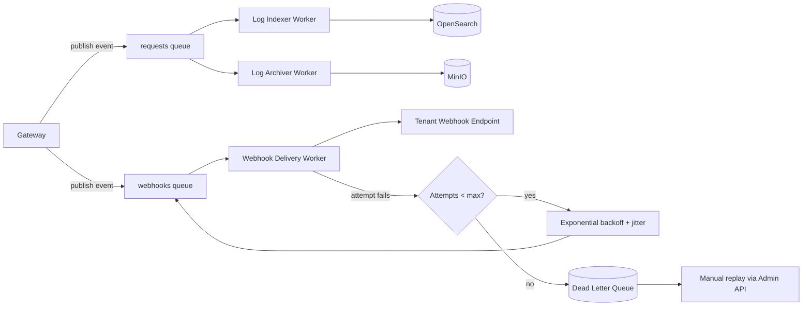
```mermaid
flowchart LR
    GW[Gateway] -- publish event --> Q1[requests queue]
    GW -- publish event --> Q2[webhooks queue]

    Q1 --> W1[Log Indexer Worker] --> OS[(OpenSearch)]
    Q1 --> W2[Log Archiver Worker] --> MI[(MinIO)]
    Q2 --> W3[Webhook Delivery Worker] --> EXT[Tenant Webhook Endpoint]

    W3 -- attempt fails --> RETRY{Attempts < max?}
    RETRY -- yes --> BACKOFF[Exponential backoff + jitter] --> Q2
    RETRY -- no --> DLQ[(Dead Letter Queue)]
    DLQ --> ADMIN[Manual replay via Admin API]
```

### 10.2 Queues & workers

| Queue | Producer | Consumer | Concurrency | Priority |
|---|---|---|---|---|
| `requests` | Gateway (every completed/failed request) | Log Indexer, Log Archiver | 10 | normal |
| `webhooks` | Gateway (event matches tenant subscription) | Webhook Delivery Worker | 5 | high (time-sensitive) |
| `exports` | Admin API (user-triggered export) | Export Worker | 2 | low |

### 10.3 Retry & backoff policy

| Job type | Max attempts | Backoff | DLQ behavior |
|---|---|---|---|
| Webhook delivery | 5 | Exponential: 1s, 5s, 30s, 2m, 10m (+ jitter) | Moved to DLQ; visible in admin UI; manually replayable |
| Log indexing | 3 | Fixed: 2s | Logged as error; dropped (non-critical path) |
| Log archival | 5 | Exponential | Retried on next scheduled run if exhausted |

### 10.4 Idempotency

Every emitted event carries a stable `event_id` (UUID generated once at emission). Webhook payloads include this ID; receivers are documented to dedupe on it. On the delivery side, `webhook_deliveries` has a `UNIQUE(webhook_id, event_id)` constraint — a retried BullMQ job that already recorded a successful delivery **will not re-insert**, making the worker itself idempotent even if BullMQ ever double-processes a job (e.g. after a crash mid-ack).

### 10.5 Dead Letter Queue state diagram

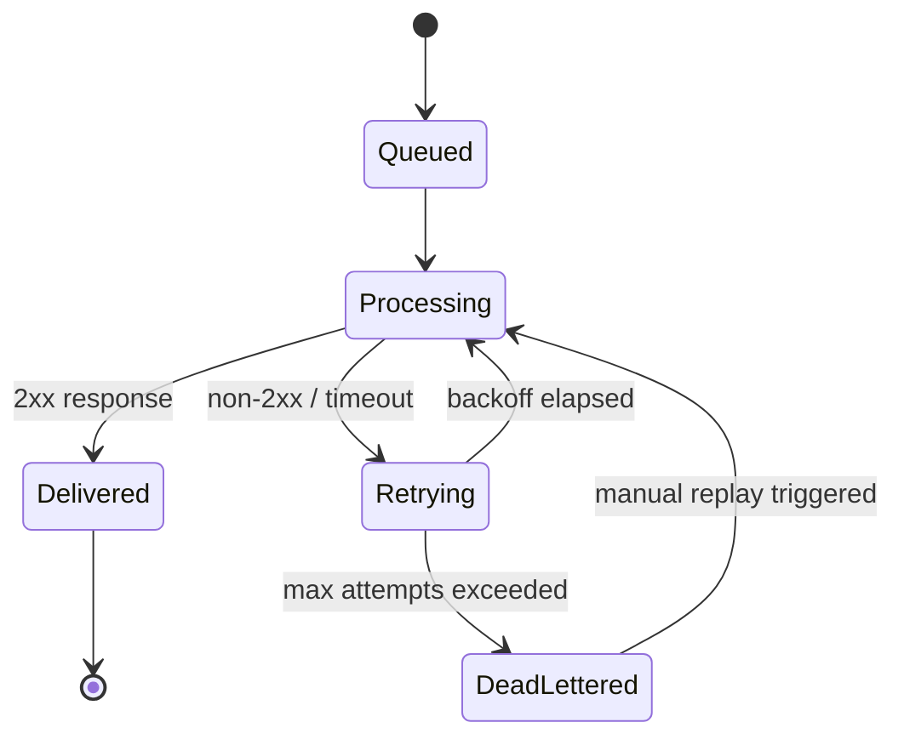
```mermaid
stateDiagram-v2
    [*] --> Queued
    Queued --> Processing
    Processing --> Delivered: 2xx response
    Processing --> Retrying: non-2xx / timeout
    Retrying --> Processing: backoff elapsed
    Retrying --> DeadLettered: max attempts exceeded
    DeadLettered --> Processing: manual replay triggered
    Delivered --> [*]
```

---

## 11. Search Architecture

### 11.1 Index design

**Index:** `airlock-requests-{yyyy.MM.dd}` (daily rotation, aliased under `airlock-requests-*`)

```json
{
  "mappings": {
    "properties": {
      "request_id":   { "type": "keyword" },
      "tenant_id":    { "type": "keyword" },
      "route":        { "type": "keyword" },
      "method":       { "type": "keyword" },
      "status_code":  { "type": "integer" },
      "latency_ms":   { "type": "integer" },
      "upstream":     { "type": "keyword" },
      "cache_hit":    { "type": "boolean" },
      "rate_limited": { "type": "boolean" },
      "error_message":{ "type": "text" },
      "user_agent":   { "type": "text" },
      "ip_hash":      { "type": "keyword" },
      "timestamp":    { "type": "date" }
    }
  }
}
```

Daily indices + an ILM-style lifecycle (rollover, delete after N days) keep the hot index small; older docs are archived to MinIO ([§12](#12-object-storage)) before deletion from OpenSearch.

### 11.2 Search API surface

| Endpoint | Query params | Purpose |
|---|---|---|
| `GET /logs/search` | `q, tenant_id, route, status_code, from, to, page` | Full-text + filtered search over request logs |
| `GET /logs/aggregate` | `tenant_id, groupBy, window` | Aggregations: error rate over time, top routes, top tenants |

### 11.3 Ranking & filters

Log search is not relevance-ranked in the traditional sense (no "best match" scoring needed) — it's primarily **filtered + sorted by recency**, with `q` performing a `multi_match` full-text query across `error_message` and `user_agent`. This is a deliberate, defensible scope decision: Airlock's search need is operational log search, not information-retrieval ranking (that problem belongs to the future Crawlspace project).

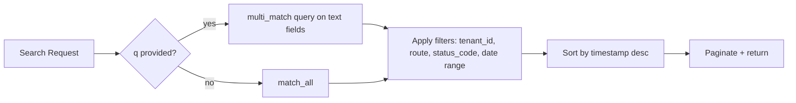
```mermaid
flowchart LR
    A[Search Request] --> B{q provided?}
    B -- yes --> C[multi_match query on text fields]
    B -- no --> D[match_all]
    C --> E[Apply filters: tenant_id, route, status_code, date range]
    D --> E
    E --> F[Sort by timestamp desc]
    F --> G[Paginate + return]
```

---

## 12. Object Storage

### 12.1 MinIO bucket structure

```
airlock (MinIO server)
├── request-archives/
│   └── {tenant_id}/{yyyy}/{MM}/{dd}/{request_id}.json.gz
├── analytics-exports/
│   └── {tenant_id}/{export_id}.csv
└── webhook-payloads/
    └── {webhook_id}/{event_id}.json      (kept for replay/debugging)
```

### 12.2 Lifecycle policy

| Bucket | Retention | Policy |
|---|---|---|
| `request-archives` | 90 days | Auto-delete via MinIO lifecycle rule after 90d |
| `analytics-exports` | 7 days | Auto-delete — exports are meant to be downloaded promptly |
| `webhook-payloads` | 30 days | Supports manual DLQ replay within this window |

### 12.3 Upload flow

Request/response bodies are gzip-compressed and streamed to MinIO by the **Log Archiver Worker** (async, off the request's critical path) once a document ages out of the OpenSearch hot window. Object key includes tenant + date partitioning so per-tenant export queries can use prefix listing efficiently.

### 12.4 Replay storage

`request-archives` objects contain the full original request (headers, body, target route) needed to power the **Request Replay** feature ([FR-20](#3-functional-requirements)): the admin can select an archived request and have the gateway re-issue it against the (possibly now-fixed) upstream, useful for debugging reported incidents without asking the partner to resend traffic.

---

## 13. Authentication

### 13.1 Two authentication planes

| Plane | Used by | Mechanism |
|---|---|---|
| **Machine-to-machine** | API consumers calling proxied routes | API Key (`X-API-Key` header) |
| **Human** | Admin dashboard users | JWT access + refresh token pair |

### 13.2 API key lifecycle

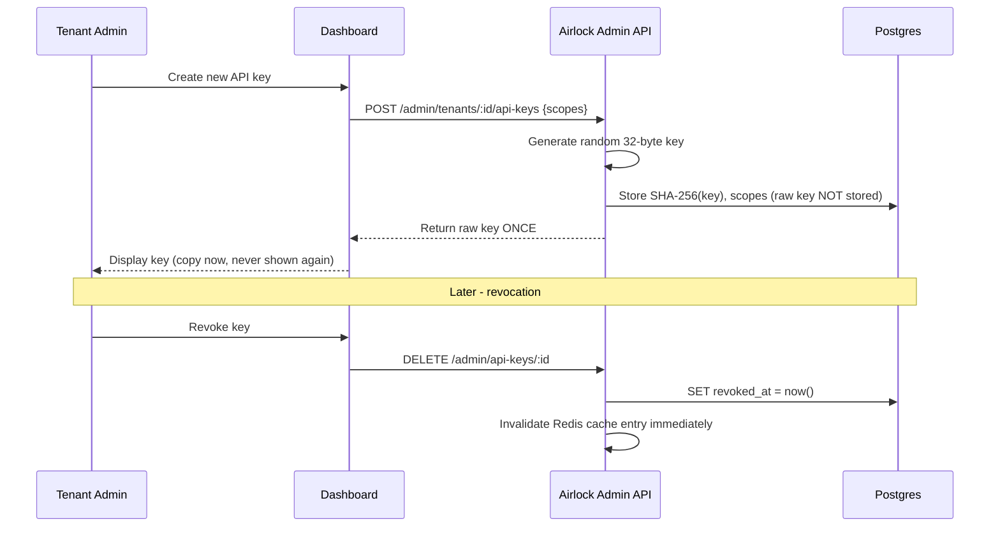
```mermaid
sequenceDiagram
    participant Admin as Tenant Admin
    participant Dashboard
    participant API as Airlock Admin API
    participant DB as Postgres

    Admin->>Dashboard: Create new API key
    Dashboard->>API: POST /admin/tenants/:id/api-keys {scopes}
    API->>API: Generate random 32-byte key
    API->>DB: Store SHA-256(key), scopes (raw key NOT stored)
    API-->>Dashboard: Return raw key ONCE
    Dashboard-->>Admin: Display key (copy now, never shown again)

    Note over Admin,DB: Later - revocation
    Admin->>Dashboard: Revoke key
    Dashboard->>API: DELETE /admin/api-keys/:id
    API->>DB: SET revoked_at = now()
    API->>API: Invalidate Redis cache entry immediately
```

### 13.3 JWT access + refresh rotation

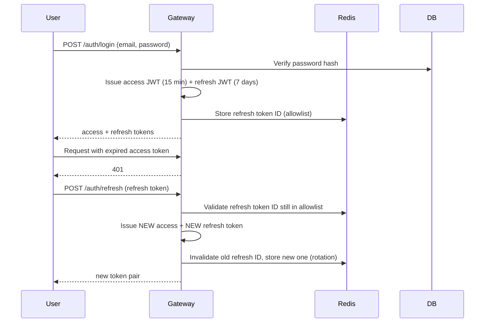
```mermaid
sequenceDiagram
    participant User
    participant Gateway
    participant Redis
    participant DB

    User->>Gateway: POST /auth/login (email, password)
    Gateway->>DB: Verify password hash
    Gateway->>Gateway: Issue access JWT (15 min) + refresh JWT (7 days)
    Gateway->>Redis: Store refresh token ID (allowlist)
    Gateway-->>User: access + refresh tokens

    User->>Gateway: Request with expired access token
    Gateway-->>User: 401
    User->>Gateway: POST /auth/refresh (refresh token)
    Gateway->>Redis: Validate refresh token ID still in allowlist
    Gateway->>Gateway: Issue NEW access + NEW refresh token
    Gateway->>Redis: Invalidate old refresh ID, store new one (rotation)
    Gateway-->>User: new token pair
```

**Rotation rule**: every refresh invalidates the previous refresh token immediately (single-use refresh tokens). If an already-used refresh token ID is presented again, the entire session family is revoked — this is the standard defense against refresh-token replay after theft.

### 13.4 Revocation

- API keys: `revoked_at` timestamp + immediate Redis cache-bust — revocation is near-instant, not bounded by TTL.
- Refresh tokens: removed from the Redis allowlist; access tokens self-expire within 15 minutes regardless.

### 13.5 OAuth (future scope)

Not in v1. Documented in [§29](#29-future-scope) as a natural extension for tenant SSO (Google/GitHub OAuth for dashboard login) — deliberately excluded from v1 to keep auth surface small and correct first.

---

## 14. Authorization

### 14.1 Role hierarchy (dashboard/admin API)

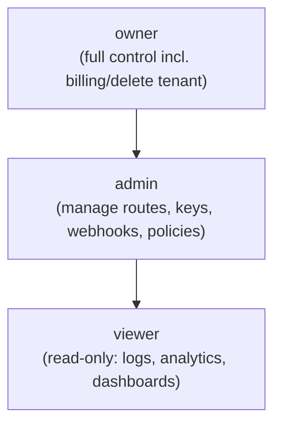
```mermaid
flowchart TD
    Owner["owner<br/>(full control incl. billing/delete tenant)"] --> Admin
    Admin["admin<br/>(manage routes, keys, webhooks, policies)"] --> Viewer
    Viewer["viewer<br/>(read-only: logs, analytics, dashboards)"]
```

| Role | Can do |
|---|---|
| `owner` | Everything `admin` can, plus: delete tenant, transfer ownership, manage billing/plan |
| `admin` | CRUD routes, API keys, rate-limit policies, webhooks; view everything |
| `viewer` | Read-only: view logs, analytics, audit log; cannot mutate config |

### 14.2 API key scopes (machine plane)

Scopes are independent of dashboard roles — a key is authorized per-scope, not per-role:

| Scope | Grants |
|---|---|
| `proxy:invoke` | Allowed to call proxied routes (the default, required scope) |
| `read:logs` | Query `/logs/search`, `/logs/aggregate` |
| `write:routes` | Mutate route config via admin API (rare — usually reserved for CI/CD keys) |
| `write:webhooks` | Register/modify webhook subscriptions |

### 14.3 Tenant isolation enforcement

Every query in every service is scoped by `tenant_id` derived from the authenticated principal — **never** taken from a client-supplied parameter. This is enforced at the data-access layer (a single `withTenantScope(tenantId)` query helper used everywhere) specifically so isolation can't be forgotten in a one-off endpoint. Tenant isolation has a dedicated integration test suite ([§24 Phase 6](#24-development-phases)) that asserts tenant A can never read tenant B's routes, keys, logs, or webhooks even with a crafted ID.

---

## 15. Rate Limiting

### 15.1 Algorithm comparison

| Algorithm | How it works | Pros | Cons |
|---|---|---|---|
| **Token bucket** | Bucket refills at fixed rate; each request consumes a token | Allows controlled bursts; simple to reason about; cheap in Redis | Slightly more state than fixed window |
| **Sliding window log** | Store timestamp of every request, count within trailing window | Most accurate | Memory-heavy at scale (one entry per request) |
| **Sliding window counter** | Weighted average of current + previous fixed window | Good accuracy, low memory | Approximate at window boundaries |
| **Leaky bucket** | Requests processed at constant outflow rate, queued otherwise | Smooths bursts completely | Adds latency; not ideal for a rate limiter meant to reject fast |
| **Fixed window** | Simple counter reset every N seconds | Cheapest | Allows 2x burst at window boundary (well-known flaw) |

### 15.2 What Airlock implements, and why

**Token bucket, implemented as an atomic Redis Lua script** ([§9.3](#93-rate-limit-script-atomic-race-safe)).

Rationale: token bucket gives tenants a predictable, explainable limit ("100 requests per minute, with the ability to burst up to bucket size") while remaining O(1) per check and trivially atomic via a single `EVAL`. Sliding-window-log was rejected because storing per-request timestamps at gateway-scale traffic is memory-prohibitive in Redis. Fixed window was rejected because of the boundary-burst flaw — a well-known gotcha worth explicitly avoiding and being able to explain in an interview.

### 15.3 Decision flow

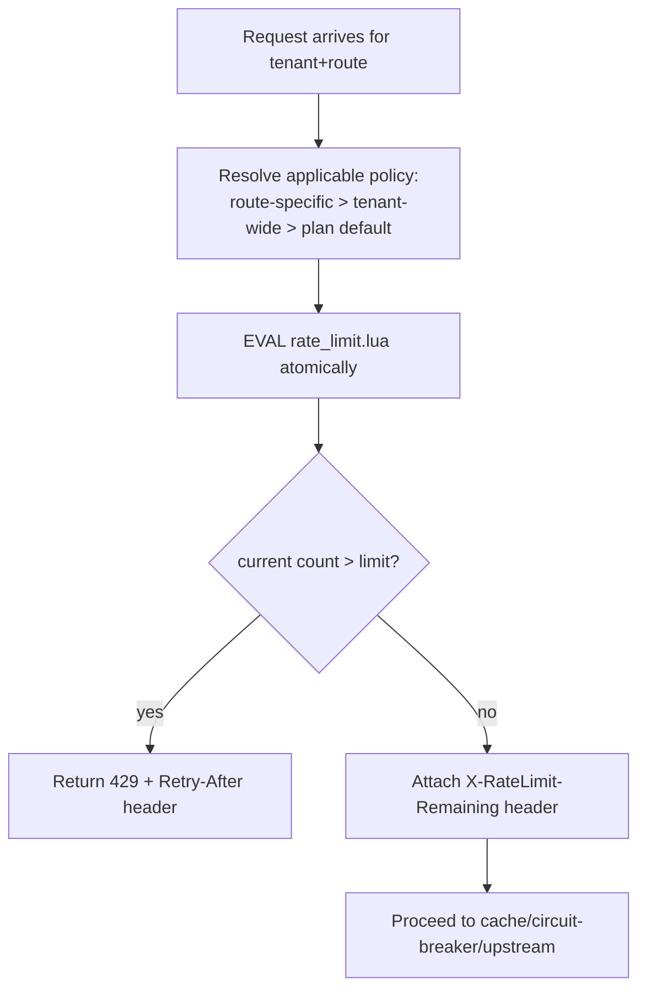
```mermaid
flowchart TD
    A[Request arrives for tenant+route] --> B[Resolve applicable policy:<br/>route-specific > tenant-wide > plan default]
    B --> C[EVAL rate_limit.lua atomically]
    C --> D{current count > limit?}
    D -- yes --> E[Return 429 + Retry-After header]
    D -- no --> F[Attach X-RateLimit-Remaining header]
    F --> G[Proceed to cache/circuit-breaker/upstream]
```

---

## 16. Circuit Breaker

### 16.1 State diagram

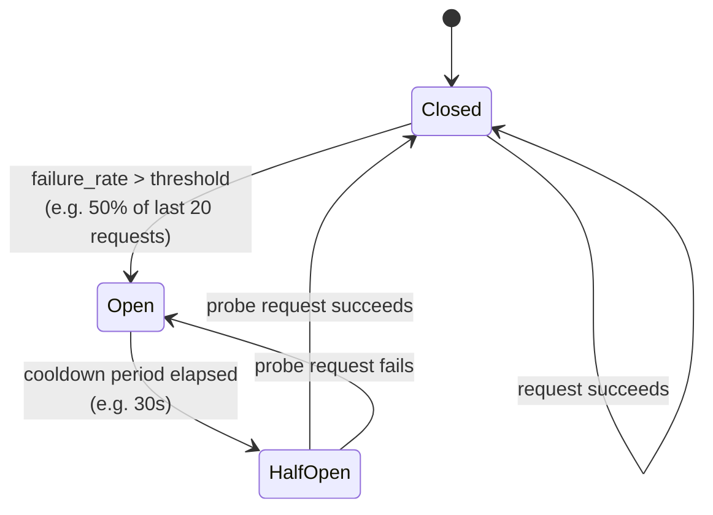
```mermaid
stateDiagram-v2
    [*] --> Closed
    Closed --> Open: failure_rate > threshold<br/>(e.g. 50% of last 20 requests)
    Open --> HalfOpen: cooldown period elapsed<br/>(e.g. 30s)
    HalfOpen --> Closed: probe request succeeds
    HalfOpen --> Open: probe request fails
    Closed --> Closed: request succeeds
```

| State | Behavior |
|---|---|
| **Closed** | Requests flow normally; failures tracked in a rolling window |
| **Open** | All requests to this upstream short-circuited with `503` immediately — no wasted calls to a known-down service |
| **Half-Open** | A single probe request allowed through; success closes the breaker, failure re-opens it |

### 16.2 Retry flow (upstream call, independent of breaker state)

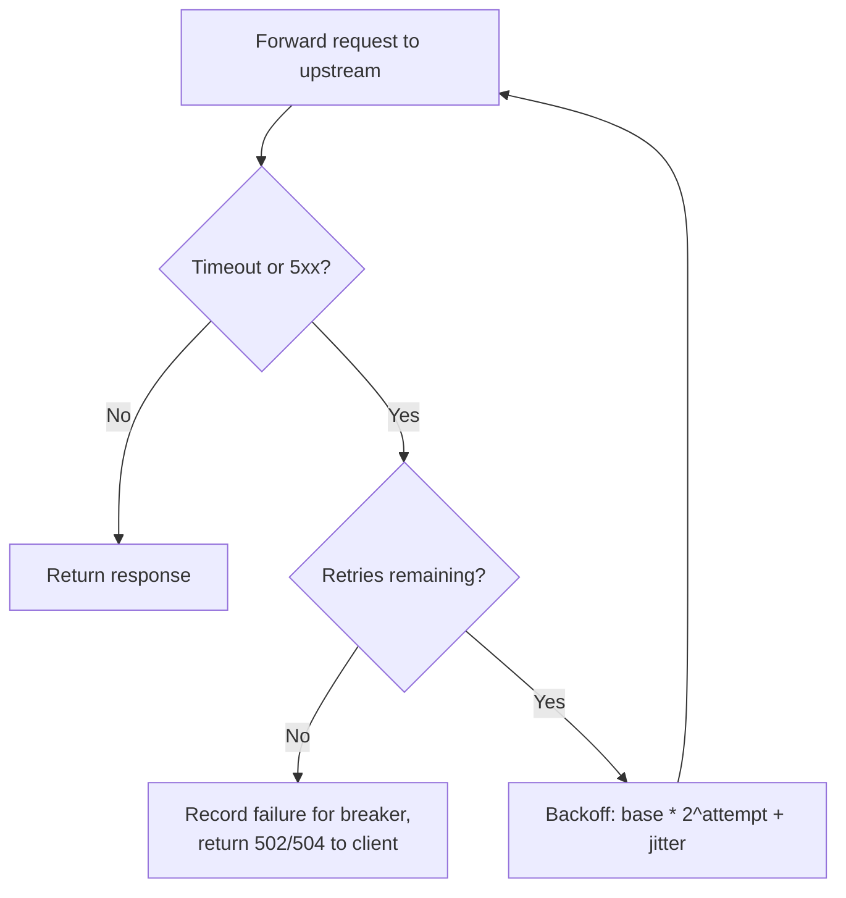
```mermaid
flowchart TD
    A[Forward request to upstream] --> B{Timeout or 5xx?}
    B -- No --> C[Return response]
    B -- Yes --> D{Retries remaining?}
    D -- No --> E[Record failure for breaker,<br/>return 502/504 to client]
    D -- Yes --> F[Backoff: base * 2^attempt + jitter]
    F --> A
```

Retries are capped (default: 2 retries, i.e. 3 total attempts) and only applied to idempotent methods (GET, PUT, DELETE) — POST is not automatically retried to avoid duplicate side-effects on the upstream, unless the caller supplies an `Idempotency-Key` header.

---

## 17. Caching

### 17.1 Strategy: Cache-Aside

Airlock uses **cache-aside** (lazy loading), not write-through: the gateway checks Redis first; on a miss, it calls the upstream and populates the cache. Write-through was rejected because the gateway does not own writes to upstream services — it only proxies to them, so there's no natural "write path" to hook into.

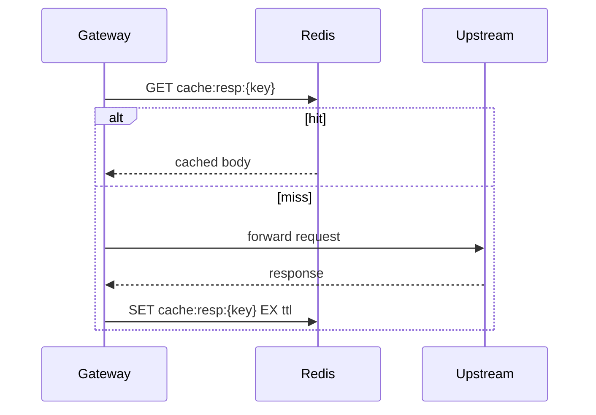
```mermaid
sequenceDiagram
    participant Gateway
    participant Redis
    participant Upstream

    Gateway->>Redis: GET cache:resp:{key}
    alt hit
        Redis-->>Gateway: cached body
    else miss
        Gateway->>Upstream: forward request
        Upstream-->>Gateway: response
        Gateway->>Redis: SET cache:resp:{key} EX ttl
    end
```

### 17.2 TTL policy

TTL is configured **per route** (`routes.cache_ttl_s`), not globally — a `/v1/exchange-rates` route might cache for 5 seconds while a `/v1/static-config` route caches for an hour. This per-route control is itself a resume-worthy design point: one global cache TTL is a beginner mistake.

### 17.3 Invalidation on mutation

Two invalidation triggers:
1. **Natural expiry** — TTL elapses, next request is a cache miss.
2. **Explicit invalidation** — when an admin updates a route's config (e.g. disables caching, or an upstream signals staleness via a documented `POST /admin/cache/invalidate` endpoint), the gateway issues a Redis `DEL` on the relevant key pattern immediately.

### 17.4 Why cache invalidation is difficult (and how this project confronts it)

The classic "two hard things in computer science" problem shows up concretely here: a cached response can become stale the instant the upstream's underlying data changes, and the gateway has **no visibility** into upstream data mutations by default. Airlock's answer is deliberately explicit rather than magical: (a) short, per-route TTLs bound staleness by default, and (b) upstream services that need immediate invalidation must call the `/admin/cache/invalidate` endpoint as part of their own write path — trading a small integration cost for correctness. This is exactly the kind of trade-off interviewers want to hear articulated, rather than a hand-wave.

---

## 18. Event-Driven Architecture

### 18.1 Event catalog

| Event | Producer | Consumers | Payload highlights |
|---|---|---|---|
| `request.completed` | Gateway (after successful proxy) | Log Indexer, Analytics, Dashboard (SSE) | request_id, tenant_id, route, status, latency_ms |
| `request.failed` | Gateway (upstream error/timeout) | Log Indexer, Dashboard (SSE), Circuit Breaker | request_id, error, upstream |
| `rate_limit.exceeded` | Gateway | Log Indexer, Dashboard (SSE), Webhook Dispatcher | tenant_id, route, limit, current |
| `breaker.opened` | Gateway (circuit breaker) | Dashboard (SSE), Webhook Dispatcher, Alerting | upstream_id, failure_rate |
| `webhook.delivered` | Webhook Worker | Audit Log | webhook_id, event_id, attempt_count |
| `webhook.dead_lettered` | Webhook Worker | Dashboard, Alerting | webhook_id, event_id, last_error |
| `apikey.revoked` | Admin API | Audit Log, Cache invalidation | api_key_id, tenant_id |
| `route.updated` | Admin API | Cache invalidation, Audit Log | route_id, changed_fields |

### 18.2 Event flow diagram

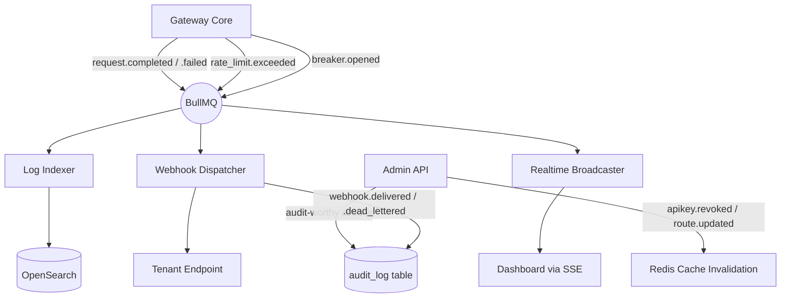
```mermaid
flowchart TB
    GW[Gateway Core] -->|request.completed / .failed| BQ((BullMQ))
    GW -->|rate_limit.exceeded| BQ
    GW -->|breaker.opened| BQ
    ADMIN[Admin API] -->|apikey.revoked / route.updated| CACHE[Redis Cache Invalidation]
    ADMIN -->|audit-worthy actions| AUDIT[(audit_log table)]

    BQ --> IDX[Log Indexer] --> OS[(OpenSearch)]
    BQ --> WH[Webhook Dispatcher] --> TENANT[Tenant Endpoint]
    BQ --> RT[Realtime Broadcaster] --> DASH[Dashboard via SSE]
    WH -->|webhook.delivered / .dead_lettered| AUDIT
```

Every event is a plain fact ("this happened"), not a command — consumers decide independently what to do with it, which is the core property that keeps this architecture decoupled and lets new consumers (e.g. a future alerting service) be added without touching the gateway core.

---

## 19. Logging

### 19.1 Pino configuration approach

- JSON structured logs (never plain text) — required for OpenSearch ingestion.
- A `requestId` (correlation ID) generated at ingress (or propagated from an incoming `X-Request-Id` header) is attached to Pino's child logger and threaded through every downstream log line, including inside BullMQ workers processing that request's events.

### 19.2 Correlation ID propagation

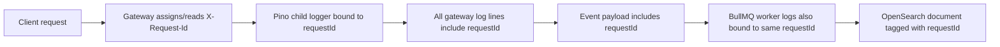
```mermaid
flowchart LR
    A[Client request] --> B[Gateway assigns/reads X-Request-Id]
    B --> C[Pino child logger bound to requestId]
    C --> D[All gateway log lines include requestId]
    D --> E[Event payload includes requestId]
    E --> F[BullMQ worker logs also bound to same requestId]
    F --> G[OpenSearch document tagged with requestId]
```

This means: given one `request_id`, you can search OpenSearch and reconstruct the *entire* lifecycle of that request — gateway decision, upstream call, webhook delivery attempt — a real production debugging capability.

### 19.3 Log levels

| Level | Used for |
|---|---|
| `fatal` | Process cannot continue (e.g. Postgres connection pool exhausted at startup) |
| `error` | Request failed due to unexpected error; upstream unreachable; webhook exhausted retries |
| `warn` | Rate limit exceeded; circuit breaker opened; cache invalidation failure |
| `info` | Request completed; admin action performed; worker job completed |
| `debug` | Cache hit/miss detail; rate-limit remaining count; retry attempt number |

### 19.4 Log format example

```json
{
  "level": "info",
  "time": "2026-08-02T10:15:32.101Z",
  "requestId": "req_9f3a1c",
  "tenantId": "acme-corp",
  "route": "/v1/payments",
  "statusCode": 200,
  "latencyMs": 42,
  "cacheHit": false,
  "msg": "request.completed"
}
```

---

## 20. Monitoring

### 20.1 Prometheus metrics

| Metric | Type | Labels | Purpose |
|---|---|---|---|
| `airlock_requests_total` | Counter | tenant, route, status_code | Traffic volume |
| `airlock_request_duration_ms` | Histogram | tenant, route | Latency percentiles (p50/p95/p99) |
| `airlock_rate_limit_rejections_total` | Counter | tenant, route | Abuse/throttling visibility |
| `airlock_cache_hits_total` / `_misses_total` | Counter | route | Cache effectiveness |
| `airlock_circuit_breaker_state` | Gauge (0/1/2) | upstream | Closed/Half-Open/Open |
| `airlock_queue_depth` | Gauge | queue_name | BullMQ backlog per queue |
| `airlock_webhook_delivery_duration_ms` | Histogram | webhook_id | Delivery latency |
| `airlock_webhook_dlq_total` | Counter | webhook_id | Dead-lettered event count |

### 20.2 Grafana dashboards

| Dashboard | Panels |
|---|---|
| **Traffic Overview** | Requests/sec, error rate, top routes, top tenants |
| **Latency** | p50/p95/p99 per route, slowest routes table |
| **Rate Limiting & Abuse** | Rejections over time, tenants nearest their limit |
| **Resilience** | Circuit breaker state per upstream, retry counts |
| **Queues** | Queue depth over time, DLQ size, job processing rate |

### 20.3 Health checks

| Endpoint | Checks |
|---|---|
| `GET /health/liveness` | Process is up (no dependency checks — for restart decisions) |
| `GET /health/readiness` | Postgres reachable, Redis reachable — for load-balancer routing decisions |

### 20.4 Alerts (documented, Prometheus Alertmanager rules)

| Alert | Condition |
|---|---|
| `HighErrorRate` | 5xx rate > 5% over 5 min for any route |
| `CircuitBreakerOpen` | `airlock_circuit_breaker_state == 2` for > 1 min |
| `QueueBacklogGrowing` | `airlock_queue_depth` increasing for 10 min straight |
| `WebhookDLQGrowing` | `airlock_webhook_dlq_total` rate > 0 sustained |

---

## 21. Security

### 21.1 Threat model (STRIDE-oriented)

| Threat | Vector | Mitigation |
|---|---|---|
| **Spoofing** | Forged API key / JWT | Key hashing (SHA-256), JWT signature verification, short-lived access tokens |
| **Tampering** | Modified webhook payload in transit | HMAC-SHA256 signature on every webhook payload; receiver verifies |
| **Repudiation** | Admin denies making a change | Immutable, append-only `audit_log` for every mutating admin action |
| **Information disclosure** | Tenant A reads Tenant B's data | Mandatory `tenant_id` scoping at the data-access layer ([§14.3](#143-tenant-isolation-enforcement)) |
| **Denial of service** | Abusive tenant floods the gateway | Rate limiting ([§15](#15-rate-limiting)) + circuit breaker containment |
| **Elevation of privilege** | Viewer role calls admin mutation endpoint | RBAC middleware checked on every admin route, tested explicitly |
| **SSRF** | Route configured with `upstream_url` pointing at internal metadata endpoints (e.g. `169.254.169.254`) or `localhost` | Upstream URL allowlist validation at route-creation time; block private/link-local IP ranges unless explicitly flagged as an internal route |
| **Replay attacks** | Captured request re-sent by an attacker | `Idempotency-Key` support on mutating routes; webhook signatures include a timestamp checked against a tolerance window |

### 21.2 Concrete controls

- **API key hashing**: only SHA-256 hashes ever touch the database; the raw key is shown exactly once at creation.
- **Secrets management**: all credentials (DB password, JWT signing secret, MinIO keys) via environment variables / Docker secrets — never committed.
- **CORS**: strict allowlist of dashboard origins; proxied routes themselves pass through upstream CORS untouched.
- **Helmet**: standard security headers (HSTS, X-Content-Type-Options, X-Frame-Options) on the admin API and dashboard.
- **Input validation**: schema validation (e.g. Zod) on every admin API body — especially `upstream_url` and `path_pattern`, the two fields with real injection/SSRF blast radius.
- **Password storage**: bcrypt/argon2, never reversible encryption.

### 21.3 SSRF prevention flow

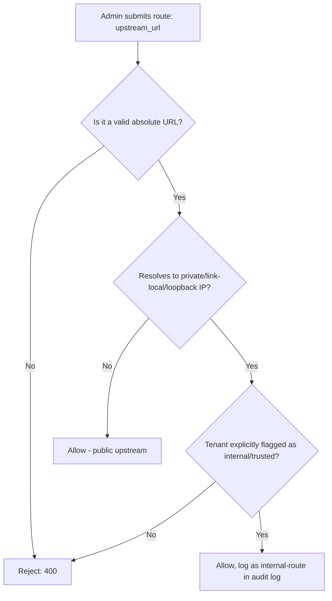
```mermaid
flowchart TD
    A[Admin submits route: upstream_url] --> B{Is it a valid absolute URL?}
    B -- No --> R[Reject: 400]
    B -- Yes --> C{Resolves to private/link-local/loopback IP?}
    C -- Yes --> D{Tenant explicitly flagged as internal/trusted?}
    D -- No --> R
    D -- Yes --> E[Allow, log as internal-route in audit log]
    C -- No --> F[Allow - public upstream]
```

---

## 22. API Design

### 22.1 Endpoint groups

| Group | Base path | Auth |
|---|---|---|
| Proxy (the core feature) | `/proxy/:tenantSlug/*` | API Key |
| Auth | `/auth/*` | Public (login/refresh) |
| Tenant admin | `/admin/tenants/*` | JWT (owner/admin) |
| Route config | `/admin/routes/*` | JWT (admin) |
| Rate-limit policies | `/admin/rate-limit-policies/*` | JWT (admin) |
| API keys | `/admin/api-keys/*` | JWT (admin) |
| Webhooks | `/admin/webhooks/*` | JWT (admin) |
| Logs & analytics | `/logs/*`, `/analytics/*` | JWT (any role) or API key with `read:logs` |
| Observability | `/health/*`, `/metrics` | none / internal network only |

### 22.2 Representative requests/responses

**Create a route**

```http
POST /admin/routes
Authorization: Bearer <jwt>
Content-Type: application/json

{
  "pathPattern": "/v1/payments",
  "upstreamUrl": "http://payments-service:4000",
  "methods": ["GET", "POST"],
  "authRequired": true,
  "cacheable": false
}
```

```json
{
  "id": "9c1e2f3a-...",
  "tenantId": "acme-corp",
  "pathPattern": "/v1/payments",
  "upstreamUrl": "http://payments-service:4000",
  "methods": ["GET", "POST"],
  "cacheable": false,
  "createdAt": "2026-08-02T10:00:00Z"
}
```

**Proxied call hitting a rate limit**

```http
GET /proxy/acme-corp/v1/payments
X-API-Key: gk_live_9f3a1c...
```

```json
HTTP/1.1 429 Too Many Requests
Retry-After: 12
X-RateLimit-Limit: 100
X-RateLimit-Remaining: 0

{ "error": "rate_limit_exceeded", "retryAfterSeconds": 12 }
```

**Search logs**

```http
GET /logs/search?tenant_id=acme-corp&status_code=500&from=2026-08-01&to=2026-08-02
Authorization: Bearer <jwt>
```

```json
{
  "total": 3,
  "results": [
    {
      "requestId": "req_9f3a1c",
      "route": "/v1/payments",
      "statusCode": 500,
      "latencyMs": 812,
      "errorMessage": "upstream timeout",
      "timestamp": "2026-08-01T22:14:03Z"
    }
  ]
}
```

### 22.3 OpenAPI/Swagger structure

```
openapi.yaml
├── info (title, version, description)
├── servers
├── components
│   ├── securitySchemes: { ApiKeyAuth, BearerAuth }
│   ├── schemas: { Tenant, Route, ApiKey, RateLimitPolicy, Webhook, AuditLogEntry }
│   └── responses: { 401Unauthorized, 403Forbidden, 429RateLimited }
├── paths
│   ├── /auth/*
│   ├── /admin/tenants/*
│   ├── /admin/routes/*
│   ├── /admin/rate-limit-policies/*
│   ├── /admin/api-keys/*
│   ├── /admin/webhooks/*
│   ├── /logs/*
│   ├── /analytics/*
│   └── /proxy/{tenantSlug}/{*path}
```

Served interactively via Swagger UI at `/docs` — generated from the same schema objects used for request validation (single source of truth, no drift between docs and validation).

---

## 23. Folder Structure

```
airlock/
├── docker-compose.yml
├── docker-compose.override.yml
├── .env.example
├── README.md
├── docs/
│   ├── AIRLOCK_PROJECT_BLUEPRINT.md      # this document
│   ├── ARCHITECTURE.md
│   └── openapi.yaml
├── gateway/                                  # core proxy service
│   ├── src/
│   │   ├── index.ts                          # entrypoint
│   │   ├── config/                           # env parsing, constants
│   │   ├── middleware/
│   │   │   ├── auth.ts                        # API key + JWT verification
│   │   │   ├── authorize.ts                   # scope/RBAC checks
│   │   │   ├── rateLimit.ts                   # Redis Lua rate limiter
│   │   │   ├── cache.ts                       # cache-aside logic
│   │   │   ├── circuitBreaker.ts
│   │   │   └── correlationId.ts               # Pino child-logger binding
│   │   ├── proxy/
│   │   │   ├── router.ts                      # route resolution
│   │   │   └── forwarder.ts                   # upstream HTTP call + retry
│   │   ├── admin/                             # admin REST API
│   │   │   ├── tenants.controller.ts
│   │   │   ├── routes.controller.ts
│   │   │   ├── apiKeys.controller.ts
│   │   │   ├── rateLimitPolicies.controller.ts
│   │   │   └── webhooks.controller.ts
│   │   ├── analytics/
│   │   │   ├── logs.controller.ts             # OpenSearch-backed search
│   │   │   └── aggregate.controller.ts
│   │   ├── events/
│   │   │   ├── publisher.ts                   # BullMQ producer wrapper
│   │   │   └── catalog.ts                     # event type definitions
│   │   ├── realtime/
│   │   │   └── sse.ts                         # live dashboard feed
│   │   ├── db/
│   │   │   ├── schema.sql
│   │   │   └── client.ts
│   │   ├── redis/
│   │   │   ├── client.ts
│   │   │   └── scripts/rateLimit.lua
│   │   └── observability/
│   │       ├── metrics.ts                     # prom-client setup
│   │       └── logger.ts                      # Pino setup
│   ├── test/
│   │   ├── unit/
│   │   ├── integration/
│   │   └── load/                              # k6 scripts
│   ├── Dockerfile
│   └── package.json
├── workers/                                   # BullMQ worker process(es)
│   ├── src/
│   │   ├── index.ts
│   │   ├── webhookDelivery.worker.ts
│   │   ├── logIndexer.worker.ts
│   │   └── logArchiver.worker.ts
│   ├── Dockerfile
│   └── package.json
├── dashboard/                                 # React admin/analytics UI
│   ├── src/
│   │   ├── pages/ (Tenants, Routes, ApiKeys, Webhooks, LogExplorer, LiveTraffic)
│   │   └── components/
│   ├── Dockerfile
│   └── package.json
├── monitoring/
│   ├── prometheus.yml
│   └── grafana/
│       ├── dashboards/
│       └── provisioning/
└── .github/
    └── workflows/
        └── ci.yml
```

### 23.1 Folder rationale

| Folder | Why it's separated |
|---|---|
| `gateway/` vs `workers/` | Different scaling profiles — gateway scales with request volume, workers scale with queue depth; separating them means they can be scaled and deployed independently |
| `middleware/` | Every cross-cutting concern (auth, rate limit, cache, breaker) is an isolated, independently testable middleware — mirrors the request-lifecycle diagram in [§6](#6-request-lifecycle) 1:1 |
| `events/catalog.ts` | Single source of truth for event names/payload shapes, imported by both gateway (producer) and workers (consumer) to prevent drift |
| `test/load/` | Load tests are first-class, not an afterthought — they're the evidence behind the "rate limiting holds under concurrency" resume claim |

---

## 24. Development Phases

### 24.1 Phase timeline

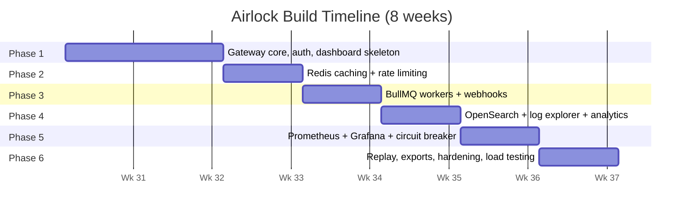
```mermaid
gantt
    title Airlock Build Timeline (8 weeks)
    dateFormat  YYYY-MM-DD
    axisFormat  Wk %W
    section Phase 1
    Gateway core, auth, dashboard skeleton   :p1, 2026-08-03, 14d
    section Phase 2
    Redis caching + rate limiting            :p2, after p1, 7d
    section Phase 3
    BullMQ workers + webhooks                :p3, after p2, 7d
    section Phase 4
    OpenSearch + log explorer + analytics    :p4, after p3, 7d
    section Phase 5
    Prometheus + Grafana + circuit breaker   :p5, after p4, 7d
    section Phase 6
    Replay, exports, hardening, load testing :p6, after p5, 7d
```

### 24.2 Phase 1 — Foundation: Gateway, Auth, Proxy, Dashboard skeleton

| | |
|---|---|
| **Objectives** | Stand up the core proxy and admin authentication so every later phase has something real to attach to |
| **Features** | Reverse proxy routing, tenant/user model, JWT login+refresh, API key issuance, route CRUD, Swagger docs |
| **Deliverables** | Running `docker compose up` with gateway + Postgres; able to proxy a request through to a dummy upstream with API-key auth |
| **Architecture changes** | Establishes `gateway/` service and Postgres schema |
| **Database changes** | `tenants`, `users`, `api_keys`, `routes` tables created |
| **New APIs** | `/auth/*`, `/admin/tenants/*`, `/admin/routes/*`, `/admin/api-keys/*`, `/proxy/*` (basic, unauthenticated-limit version) |
| **Estimated time** | 2 weeks |
| **Complexity** | Medium |
| **Resume value** | "Built a multi-tenant reverse-proxy gateway with JWT + API-key authentication and OpenAPI-documented admin API" |
| **Interview topics unlocked** | JWT vs API keys, refresh token rotation, reverse proxy fundamentals, multi-tenant schema design |
| **Recommended git commits** | `feat(db): initial schema for tenants, users, api_keys, routes`, `feat(auth): JWT login + refresh rotation`, `feat(auth): API key issuance and hashed validation`, `feat(proxy): basic route resolution and forwarding`, `feat(docs): OpenAPI spec + Swagger UI`, `chore(docker): compose skeleton for gateway + postgres` |
| **GitHub milestone** | `v0.1 — Foundation` |
| **README updates** | Project overview, architecture diagram (link to this blueprint), quickstart (`docker compose up`) |
| **Screenshots** | Swagger UI showing all Phase-1 endpoints; a successful proxied request in Postman/curl |

### 24.3 Phase 2 — Redis: Caching & Rate Limiting

| | |
|---|---|
| **Objectives** | Introduce shared ephemeral state; make the gateway actually protect upstreams |
| **Features** | Cache-aside response caching, token-bucket rate limiting, per-tenant/per-route policy config |
| **Deliverables** | Rate-limit headers on every response; measurable cache hit-rate; policy CRUD in dashboard |
| **Architecture changes** | Adds Redis to compose stack; introduces `redis/`, `middleware/rateLimit.ts`, `middleware/cache.ts` |
| **Database changes** | `rate_limit_policies` table added |
| **New APIs** | `/admin/rate-limit-policies/*` |
| **Estimated time** | 1 week |
| **Complexity** | Medium-High (atomicity correctness under concurrency is the hard part) |
| **Resume value** | "Implemented atomic, race-safe distributed rate limiting (Redis Lua) supporting per-tenant token-bucket policies" |
| **Interview topics unlocked** | Rate limiting algorithms, cache-aside vs write-through, cache invalidation, race conditions in distributed counters |
| **Recommended git commits** | `feat(redis): rate limit Lua script + middleware`, `feat(cache): cache-aside response caching per route`, `feat(admin): rate-limit-policy CRUD`, `test(rateLimit): concurrency correctness tests` |
| **GitHub milestone** | `v0.2 — Rate Limiting & Caching` |
| **README updates** | Add rate-limiting section with example headers; document cache TTL config |
| **Screenshots** | Dashboard showing rate-limit policy config; a 429 response with headers |

### 24.4 Phase 3 — Async: BullMQ, Workers, Webhooks

| | |
|---|---|
| **Objectives** | Move everything off the request's critical path into an event-driven pipeline |
| **Features** | Event emission on every request, webhook subscriptions, reliable+idempotent webhook delivery, DLQ |
| **Deliverables** | A registered webhook actually receives signed, retried delivery for real gateway events |
| **Architecture changes** | Adds `workers/` service; BullMQ queues on existing Redis |
| **Database changes** | `webhooks`, `webhook_deliveries` tables added |
| **New APIs** | `/admin/webhooks/*` |
| **Estimated time** | 1 week |
| **Complexity** | Medium-High (idempotent delivery correctness) |
| **Resume value** | "Designed an event-driven pipeline delivering at-least-once, idempotent, HMAC-signed webhooks with exponential backoff and DLQ recovery" |
| **Interview topics unlocked** | At-least-once vs exactly-once delivery, idempotency keys, DLQ patterns, event-driven architecture |
| **Recommended git commits** | `feat(events): event catalog + BullMQ publisher`, `feat(workers): webhook delivery worker with retry/backoff`, `feat(webhooks): HMAC signing + admin CRUD`, `feat(workers): DLQ + manual replay endpoint` |
| **GitHub milestone** | `v0.3 — Event-Driven Webhooks` |
| **README updates** | Event catalog table; webhook signature verification guide for "tenants" |
| **Screenshots** | Webhook delivery log in dashboard; DLQ entry with replay button |

### 24.5 Phase 4 — Search: OpenSearch, Log Explorer, Analytics

| | |
|---|---|
| **Objectives** | Make every request historically searchable and analyzable |
| **Features** | Request/response log indexing, full-text + filtered search, traffic analytics API |
| **Deliverables** | Working log explorer UI; analytics dashboard showing top tenants/routes/error rates |
| **Architecture changes** | Adds OpenSearch to compose stack; `logIndexer.worker.ts`, `analytics/` module |
| **Database changes** | None (logs live in OpenSearch, not Postgres) |
| **New APIs** | `/logs/search`, `/logs/aggregate`, `/analytics/*` |
| **Estimated time** | 1 week |
| **Complexity** | Medium |
| **Resume value** | "Built a searchable observability layer over OpenSearch indexing every proxied request, with full-text log search and traffic analytics" |
| **Interview topics unlocked** | Log-scale search design, index lifecycle management, aggregation queries |
| **Recommended git commits** | `feat(search): OpenSearch index mapping + client`, `feat(workers): log indexer worker`, `feat(analytics): log search + aggregate APIs`, `feat(dashboard): log explorer UI` |
| **GitHub milestone** | `v0.4 — Observability: Search & Analytics` |
| **README updates** | Log explorer screenshot + example search queries |
| **Screenshots** | Log explorer with a filtered search result set; analytics dashboard |

### 24.6 Phase 5 — Resilience & Metrics: Prometheus, Grafana, Circuit Breaker

| | |
|---|---|
| **Objectives** | Make the system self-describing and self-protecting |
| **Features** | Circuit breaker per upstream, Prometheus metrics, Grafana dashboards, health checks, audit log |
| **Deliverables** | Grafana dashboards live showing real traffic; a deliberately-broken upstream demonstrably trips the breaker |
| **Architecture changes** | Adds Prometheus + Grafana to compose stack; `middleware/circuitBreaker.ts`, `observability/metrics.ts` |
| **Database changes** | `audit_log` table added |
| **New APIs** | `/metrics`, `/health/liveness`, `/health/readiness` |
| **Estimated time** | 1 week |
| **Complexity** | Medium-High |
| **Resume value** | "Implemented per-upstream circuit breaking and full Prometheus/Grafana observability, cutting blast radius of upstream failures" |
| **Interview topics unlocked** | Circuit breaker pattern, health check design (liveness vs readiness), metrics instrumentation |
| **Recommended git commits** | `feat(resilience): circuit breaker middleware`, `feat(observability): Prometheus metrics + /metrics endpoint`, `chore(monitoring): Grafana dashboards + provisioning`, `feat(audit): audit log for admin actions` |
| **GitHub milestone** | `v0.5 — Resilience & Observability` |
| **README updates** | Grafana dashboard screenshots; circuit breaker state diagram |
| **Screenshots** | Grafana traffic dashboard; circuit breaker transitioning to Open in real time |

### 24.7 Phase 6 — Advanced: Replay, Exports, Real-time Dashboard, Hardening

| | |
|---|---|
| **Objectives** | Ship the features that make this feel like a finished platform product, then prove it under load and attack |
| **Features** | MinIO archival + request replay, CSV/NDJSON exports, live SSE traffic dashboard, SSRF/tenant-isolation hardening, k6 load test |
| **Deliverables** | A load-test report with real numbers; a documented, tested SSRF defense; a live dashboard updating in real time |
| **Architecture changes** | Adds MinIO to compose stack; `logArchiver.worker.ts`, `realtime/sse.ts` |
| **Database changes** | None new (MinIO holds the payloads) |
| **New APIs** | `/admin/replay/:requestId`, `/analytics/export`, `GET /realtime/traffic` (SSE) |
| **Estimated time** | 1 week |
| **Complexity** | Medium |
| **Resume value** | "Load-tested distributed rate limiting under concurrent traffic (k6), validated tenant-isolation and SSRF defenses with a dedicated security test suite" |
| **Interview topics unlocked** | Object storage lifecycle design, SSRF prevention, load testing methodology, real-time delivery (SSE vs WebSocket) |
| **Recommended git commits** | `feat(storage): MinIO archival + request replay`, `feat(analytics): export to CSV/NDJSON`, `feat(realtime): SSE live traffic feed`, `test(security): tenant isolation + SSRF test suite`, `test(load): k6 rate-limit correctness under concurrency` |
| **GitHub milestone** | `v1.0 — Production Hardening` |
| **README updates** | Load test results table; security section; final architecture diagram ([§30](#30-final-architecture)) |
| **Screenshots** | Live traffic dashboard mid-load-test; k6 summary output |

---

## 25. Git Commit Plan

A phase-ordered, conventional-commits log suitable for the actual project history:

```
feat(db): initial schema for tenants, users, api_keys, routes
feat(auth): JWT login + refresh token rotation
feat(auth): API key issuance with SHA-256 hashing
feat(proxy): route resolution and upstream forwarding
feat(admin): tenant and route CRUD endpoints
feat(docs): OpenAPI spec and Swagger UI
chore(docker): docker-compose skeleton (gateway + postgres)

feat(redis): atomic token-bucket rate limiter (Lua script)
feat(cache): cache-aside response caching per route
feat(admin): rate-limit policy CRUD
test(rateLimit): concurrency correctness tests

feat(events): event catalog and BullMQ publisher
feat(workers): webhook delivery worker with retry and backoff
feat(webhooks): HMAC-signed webhook payloads + subscription CRUD
feat(workers): dead-letter queue and manual replay endpoint

feat(search): OpenSearch index mapping and client
feat(workers): log indexer worker
feat(analytics): log search and aggregation APIs
feat(dashboard): log explorer UI

feat(resilience): circuit breaker middleware (closed/open/half-open)
feat(observability): Prometheus metrics and /metrics endpoint
chore(monitoring): Grafana dashboards and provisioning
feat(audit): immutable audit log for admin actions

feat(storage): MinIO archival worker and request replay
feat(analytics): CSV/NDJSON export
feat(realtime): SSE live traffic dashboard feed
test(security): tenant isolation and SSRF regression suite
test(load): k6 rate-limit correctness under concurrent load

docs(readme): final architecture, benchmarks, and screenshots
ci(github-actions): lint, unit, integration, and build pipeline
```

---

## 26. Learning Roadmap

| Phase | Concepts learned |
|---|---|
| **1** | Reverse proxying, JWT vs API-key auth trade-offs, refresh token rotation, multi-tenant schema design, OpenAPI-first development |
| **2** | Atomic Redis operations (Lua/EVAL), token-bucket rate limiting, cache-aside pattern, race conditions in distributed counters |
| **3** | Event-driven architecture, at-least-once delivery, idempotency keys, exponential backoff with jitter, dead-letter queues |
| **4** | Search index design, index lifecycle/rollover, full-text vs filtered queries, aggregation queries at scale |
| **5** | Circuit breaker pattern, liveness vs readiness health checks, metrics instrumentation, dashboard design for on-call use |
| **6** | Object storage lifecycle policies, SSRF defense, replay-based debugging, load testing methodology, real-time delivery trade-offs (SSE vs WebSocket) |

---

## 27. Resume Impact

**After Phase 1:**
> Built a multi-tenant API gateway with JWT (access/refresh rotation) and hashed API-key authentication, exposing an OpenAPI-documented admin API for tenant and route management.

**After Phase 2:**
> Implemented atomic, race-safe distributed rate limiting (Redis Lua scripts, token-bucket algorithm) and cache-aside response caching, verified correct under concurrent multi-instance load.

**After Phase 3:**
> Designed an event-driven pipeline (BullMQ) delivering at-least-once, idempotent, HMAC-signed webhooks with exponential backoff and dead-letter-queue recovery.

**After Phase 4:**
> Built a searchable observability layer (OpenSearch) indexing every proxied request, powering full-text log search and real-time traffic analytics.

**After Phase 5:**
> Implemented per-upstream circuit breaking and full Prometheus/Grafana observability with liveness/readiness health checks, reducing blast radius of upstream failures.

**After Phase 6 (final):**
> Shipped a production-grade, self-hosted API gateway platform (Node.js, Postgres, Redis, OpenSearch, MinIO, BullMQ) handling multi-tenant auth, distributed rate limiting, circuit breaking, and event-driven webhook delivery — load-tested with k6 to validate correctness under concurrency, with a dedicated security test suite covering tenant isolation and SSRF defenses.

---

## 28. Interview Questions

### Google
- Design a rate limiter used by millions of clients across multiple servers.
- How would you ensure your rate limiter is correct when the service is horizontally scaled?
- Design a system to detect and isolate a failing dependency automatically.

### Amazon
- Design an API Gateway (this is a real, frequently-asked Amazon system design question).
- How do you handle a "noisy neighbor" tenant degrading service for others?
- Design a webhook delivery system that guarantees at-least-once delivery.

### Microsoft
- How would you design a caching layer that avoids stale data?
- Design a multi-tenant SaaS backend ensuring strict data isolation.
- Walk through how you'd debug a production incident using only logs and metrics.

### Atlassian
- Design an audit-logging system that is tamper-evident and queryable.
- How would you design feature-level access control (RBAC vs scopes) for a multi-tenant product?
- How do you decide what should be synchronous vs pushed to a queue?

### Cloudflare
- Design a distributed rate limiter that works at the edge across many nodes with minimal added latency.
- How would you prevent SSRF in a system that proxies to user-configured URLs?
- Design a real-time analytics dashboard for live traffic.

### Adobe
- Design a system for searching and analyzing large volumes of log data.
- How would you design object storage lifecycle policies for compliance retention requirements?
- Explain trade-offs between SSE and WebSockets for a live dashboard feature.

### Flipkart
- Design a circuit breaker and explain the half-open state's purpose.
- How would you design idempotent APIs to survive client retries during network failures?
- Design a system to safely revoke a compromised API key across a fleet of servers within seconds.

---

## 29. Future Scope

| Idea | Description |
|---|---|
| **OAuth / SSO for dashboard login** | Google/GitHub OAuth for human users, on top of existing JWT session model |
| **Plugin architecture** | Kong-style pluggable middleware (e.g. request transformation, custom auth providers) loaded dynamically per route |
| **gRPC upstream support** | Extend proxy beyond HTTP to gRPC upstreams |
| **Multi-region discussion** | Document (not necessarily build) how rate-limit state would need to move to a globally-distributed store (e.g. CRDTs or regional buckets with async reconciliation) if Airlock ran across regions |
| **WASM-based custom rules** | Let tenants write custom request-transformation logic in a sandboxed WASM runtime, similar to Cloudflare Workers |
| **Adaptive rate limiting** | Dynamically adjust limits based on upstream health/latency rather than fixed static policies |
| **GraphQL admin API** | Alternative to REST admin API for richer client-side querying |
| **Anomaly detection** | Flag traffic patterns statistically inconsistent with a tenant's baseline (potential credential leak indicator) |
| **Terraform provider** | Manage Airlock tenants/routes/policies as infrastructure-as-code |

---

## 30. Final Architecture

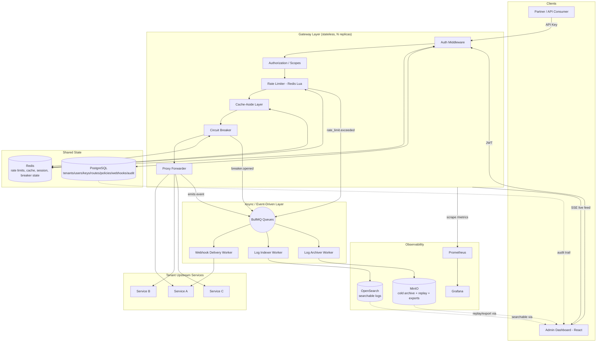
```mermaid
flowchart TB
    subgraph Clients
        C1[Partner / API Consumer]
        C2[Admin Dashboard - React]
    end

    subgraph EdgeLayer["Gateway Layer (stateless, N replicas)"]
        direction TB
        MW1[Auth Middleware] --> MW2[Authorization / Scopes]
        MW2 --> MW3[Rate Limiter - Redis Lua]
        MW3 --> MW4[Cache-Aside Layer]
        MW4 --> MW5[Circuit Breaker]
        MW5 --> MW6[Proxy Forwarder]
    end

    subgraph SharedState["Shared State"]
        PG[(PostgreSQL<br/>tenants/users/keys/routes/policies/webhooks/audit)]
        RD[(Redis<br/>rate limits, cache, session, breaker state)]
    end

    subgraph AsyncLayer["Async / Event-Driven Layer"]
        BQ((BullMQ Queues))
        W1[Webhook Delivery Worker]
        W2[Log Indexer Worker]
        W3[Log Archiver Worker]
    end

    subgraph ObservabilityStack["Observability"]
        OS[(OpenSearch<br/>searchable logs)]
        MI[(MinIO<br/>cold archive + replay + exports)]
        PR[Prometheus]
        GF[Grafana]
    end

    subgraph Upstreams["Tenant Upstream Services"]
        U1[Service A]
        U2[Service B]
        U3[Service C]
    end

    C1 -->|API Key| MW1
    C2 -->|JWT| MW1
    MW6 --> U1
    MW6 --> U2
    MW6 --> U3

    MW1 <--> RD
    MW3 <--> RD
    MW4 <--> RD
    MW5 <--> RD
    MW1 <--> PG

    MW6 -- emits event --> BQ
    MW3 -- rate_limit.exceeded --> BQ
    MW5 -- breaker.opened --> BQ

    BQ --> W1 --> U1
    BQ --> W2 --> OS
    BQ --> W3 --> MI

    EdgeLayer -- scrape /metrics --> PR --> GF
    EdgeLayer -- SSE live feed --> C2
    OS -.searchable via.-> C2
    MI -.replay/export via.-> C2

    PG -.audit trail.-> C2
```

**Reading this diagram**: every box in this document maps to exactly one node here. If you can trace a request from `C1` through the middleware chain to `U1`, and separately trace the async fan-out from `BQ` to `OS`/`MI`/webhook delivery, you understand the entire system — that is the intended test of this blueprint's completeness.

---

## Appendix: How to use this document

1. Start at [§5](#5-complete-system-architecture) and [§6](#6-request-lifecycle) to build a mental model before writing any code.
2. Follow [§24](#24-development-phases) in order — each phase is independently runnable and demoable via `docker compose up`.
3. Use [§25](#25-git-commit-plan) as the literal commit sequence.
4. After each phase, copy the corresponding entries from [§26](#26-learning-roadmap) and [§27](#27-resume-impact) into the project README and your resume draft.
5. Treat [§21](#21-security) and [§24 Phase 6](#247-phase-6--advanced-replay-exports-real-time-dashboard-hardening) as non-negotiable — a gateway with no SSRF defense or tenant-isolation tests is not resume-safe.
